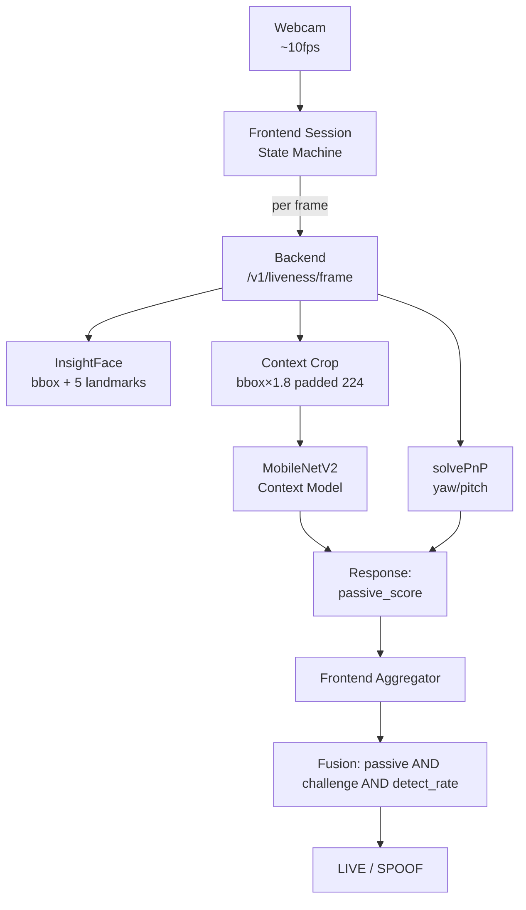
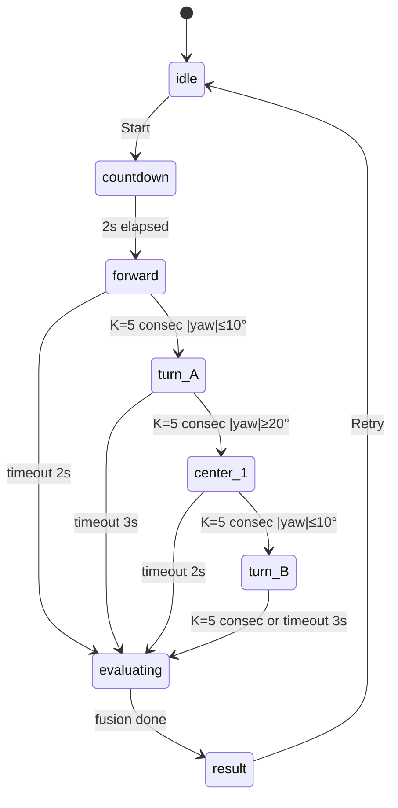

# Face Anti-Spoofing — Context-Aware Passive + Active Challenge Implementation Plan

> **For agentic workers:** REQUIRED SUB-SKILL: Use superpowers:subagent-driven-development (recommended) or superpowers:executing-plans to implement this plan task-by-task. Steps use checkbox (`- [ ]`) syntax for tracking.

**Goal:** Replace face-tight liveness with context-aware passive model + active head-turn challenge in a session-based capture flow, with structured eval to demonstrate improvement.

**Architecture:** Backend stays stateless: per-frame `/v1/liveness/frame` returns passive score + head pose; frontend runs a session state machine (countdown → forward → turn_A → center → turn_B → result), buffers frames, applies fusion (passive avg over forward-phase frames AND challenge yaw thresholds AND face-detect rate). Layer A (context model) and Layer B (challenge) are independent defenses combined in Layer C (frontend fusion).

**Tech Stack:** Python 3.11, FastAPI, PyTorch + torchvision (MobileNetV2 pretrained), InsightFace, OpenCV, React 18 + TypeScript, Vite, Vitest (new), pytest, Kaggle GPU.

**Spec:** `docs/superpowers/specs/2026-05-24-fas-context-challenge-design.md`

**Commit policy:** Do NOT add Claude co-author to commits.

---

## File Structure (locked-in decisions)

### Backend (Python)

| File | Action | Responsibility |
|---|---|---|
| `src/fas/preprocess.py` | Modify | Add `pad_to_square_then_resize` helper |
| `src/fas/celeba_spoof_prep.py` | Modify | Add `context_margin_ratio` field to `PrepConfig`, use pad helper |
| `src/fas/pose.py` | Create | `estimate_head_pose(landmarks, image_shape)` via solvePnP |
| `src/fas/types.py` | Modify | Add `context_crop_bgr` to `FaceDetection` |
| `src/fas/detection.py` | Modify | Produce `context_crop_bgr` (bbox×1.8, padded square, NOT resized) |
| `src/fas/liveness_model.py` | Modify | Accept any BGR crop; resize to `input_size` internally (already does — minor checks) |
| `src/fas/schemas.py` | Modify | Add `yaw_deg`, `pitch_deg`, `pose_ok` to `LivenessInferResponse` |
| `src/fas/service.py` | Modify | Use `context_crop_bgr`; compute pose; populate new response fields |
| `services/api/app.py` | Modify | Add new endpoint `/v1/liveness/frame`; keep `/v1/liveness/infer` |
| `tests/test_pose.py` | Create | Unit tests for `estimate_head_pose` on synthetic landmarks |
| `tests/test_preprocess_pad.py` | Create | Unit tests for `pad_to_square_then_resize` |
| `tests/api/test_frame_endpoint.py` | Create | Endpoint test for `/v1/liveness/frame` |
| `tests/api/test_service_pipeline.py` | Modify | Update fakes to provide `context_crop_bgr` |

### Notebook (Kaggle)

| File | Action | Responsibility |
|---|---|---|
| `notebooks/kaggle_full_07_train_context_mobilenetv2.ipynb` | Create | Self-contained training: data prep with `context_margin=0.8`, MobileNetV2 224, 4 visualization cells, threshold sweep |

### Frontend (TypeScript + React)

| File | Action | Responsibility |
|---|---|---|
| `apps/web/package.json` | Modify | Add `vitest`, `@testing-library/react`, `jsdom` devDeps + `test` script |
| `apps/web/vitest.config.ts` | Create | Vitest config (jsdom environment) |
| `apps/web/src/session/types.ts` | Create | `FrameRecord`, `Phase`, `Verdict`, `ChallengeEval` interfaces |
| `apps/web/src/session/fusion.ts` | Create | Pure functions: `evaluateChallenge`, `computeVerdict` |
| `apps/web/src/session/fusion.test.ts` | Create | Vitest unit tests for fusion (LIVE pass, challenge_failed, passive_low, yaw_jump, face_lost, phase_failed) |
| `apps/web/src/session/useSession.ts` | Create | React hook: state machine + capture loop + pose smoothing |
| `apps/web/src/session/SessionView.tsx` | Create | Recording UI (video + countdown + instruction overlay + realtime debug) |
| `apps/web/src/session/ResultView.tsx` | Create | Verdict display |
| `apps/web/src/App.tsx` | Major rewrite | Switch idle ↔ session ↔ result; legacy mode behind `?legacy=1` |
| `apps/web/src/styles.css` | Modify | Add session/result component styles |

### Eval tools & docs

| File | Action | Responsibility |
|---|---|---|
| `scripts/collect_webcam_eval.py` | Create | Standalone webcam recorder for evaluation data |
| `docs/WEBCAM_COLLECTION_PROTOCOL.md` | Create | Team-facing protocol: lighting, distance, devices, do/don't |
| `notebooks/eval_session_ablation.ipynb` | Create | Local notebook: baseline vs context model on real webcam data, plus session ablation |
| `reports/tier1_celeba_spoof_comparison.md` | Create (during eval) | Tier 1 results |
| `reports/tier2_webcam_frame_level.md` | Create (during eval) | Tier 2 frame results |
| `reports/tier2_webcam_session_level.md` | Create (during eval) | Tier 2 session ablation |

---

## Phase 1 — Backend Helpers & Pose (Layer A foundations + Layer B)

### Task 1: Add `pad_to_square_then_resize` helper

**Files:**
- Create: `tests/test_preprocess_pad.py`
- Modify: `src/fas/preprocess.py`

- [ ] **Step 1: Write failing tests**

Create `tests/test_preprocess_pad.py`:

```python
import numpy as np
import pytest

from fas.preprocess import pad_to_square_then_resize


def test_pad_square_already_square_resizes():
    img = np.full((40, 40, 3), 128, dtype=np.uint8)
    out = pad_to_square_then_resize(img, size=20)
    assert out.shape == (20, 20, 3)
    assert out.dtype == np.uint8
    # Pure resize, no padding, all values stay ~128
    assert int(out.mean()) == 128


def test_pad_square_wide_image_pads_top_bottom():
    # 100 wide x 40 tall -> pad top/bottom to make 100x100, then resize to 50
    img = np.full((40, 100, 3), 200, dtype=np.uint8)
    out = pad_to_square_then_resize(img, size=50, pad_value=0)
    assert out.shape == (50, 50, 3)
    # Top and bottom strips should be near 0 (pad), middle near 200
    assert out[0, 25, 0] < 50    # top padded
    assert out[49, 25, 0] < 50   # bottom padded
    assert out[25, 25, 0] > 150  # middle is image content


def test_pad_square_tall_image_pads_left_right():
    img = np.full((100, 40, 3), 200, dtype=np.uint8)
    out = pad_to_square_then_resize(img, size=50, pad_value=0)
    assert out.shape == (50, 50, 3)
    assert out[25, 0, 0] < 50
    assert out[25, 49, 0] < 50
    assert out[25, 25, 0] > 150


def test_pad_square_default_pad_value_is_mean():
    img = np.zeros((30, 60, 3), dtype=np.uint8)
    img[:, :, 0] = 100   # blue channel
    img[:, :, 1] = 150   # green
    img[:, :, 2] = 200   # red
    out = pad_to_square_then_resize(img, size=64)
    # Default pad_value=None → use per-channel mean
    # Top/bottom padding pixels should be close to (100,150,200)
    assert abs(int(out[0, 32, 0]) - 100) < 20
    assert abs(int(out[0, 32, 1]) - 150) < 20
    assert abs(int(out[0, 32, 2]) - 200) < 20


def test_pad_square_empty_image_raises():
    img = np.zeros((0, 0, 3), dtype=np.uint8)
    with pytest.raises(ValueError):
        pad_to_square_then_resize(img, size=20)
```

- [ ] **Step 2: Run tests, verify they fail**

```bash
.venv/bin/pytest tests/test_preprocess_pad.py -v
```

Expected: `ImportError` or `AttributeError` — `pad_to_square_then_resize` doesn't exist yet.

- [ ] **Step 3: Implement helper**

Append to `src/fas/preprocess.py`:

```python
def pad_to_square_then_resize(
    image_bgr: np.ndarray,
    size: int,
    pad_value: tuple[int, int, int] | int | None = None,
) -> np.ndarray:
    """Pad a BGR image to a square (centered), then resize to (size, size).

    pad_value: int (greyscale), 3-tuple (BGR), or None to use per-channel mean.
    """
    if image_bgr.size == 0:
        raise ValueError('image_bgr is empty')

    try:
        import cv2  # type: ignore
    except ImportError as exc:
        raise RuntimeError('OpenCV is required for pad_to_square_then_resize.') from exc

    h, w = image_bgr.shape[:2]
    side = max(h, w)
    pad_top = (side - h) // 2
    pad_bottom = side - h - pad_top
    pad_left = (side - w) // 2
    pad_right = side - w - pad_left

    if pad_value is None:
        mean_bgr = image_bgr.reshape(-1, image_bgr.shape[2]).mean(axis=0)
        pad_value = tuple(int(v) for v in mean_bgr.tolist())
    elif isinstance(pad_value, int):
        pad_value = (pad_value, pad_value, pad_value)

    padded = cv2.copyMakeBorder(
        image_bgr,
        pad_top, pad_bottom, pad_left, pad_right,
        borderType=cv2.BORDER_CONSTANT,
        value=pad_value,
    )
    return cv2.resize(padded, (size, size), interpolation=cv2.INTER_LINEAR)
```

- [ ] **Step 4: Run tests, verify they pass**

```bash
.venv/bin/pytest tests/test_preprocess_pad.py -v
```

Expected: 5 passing.

- [ ] **Step 5: Commit**

```bash
git add src/fas/preprocess.py tests/test_preprocess_pad.py
git commit -m "feat(preprocess): add pad_to_square_then_resize helper"
```

---

### Task 2: Add `context_margin_ratio` to `celeba_spoof_prep.PrepConfig`

**Files:**
- Modify: `src/fas/celeba_spoof_prep.py`
- Modify: `tests/test_liveness_preprocess.py` (or new test file)

- [ ] **Step 1: Inspect current `PrepConfig`**

Read `src/fas/celeba_spoof_prep.py` lines around `PrepConfig` and `crop_faces_from_manifest`. Confirm:
- `PrepConfig` has `image_size`, `bbox_margin_ratio`.
- `crop_faces_from_manifest` uses `_expand_bbox_xywh` then `resize_bgr_image`.

- [ ] **Step 2: Write failing test**

Create `tests/test_celeba_spoof_prep_context.py`:

```python
import numpy as np
import pandas as pd

from fas.celeba_spoof_prep import PrepConfig, crop_faces_from_manifest


def test_crop_uses_context_margin_and_pad_to_square(tmp_path, monkeypatch):
    # Synthetic 200x300 image (height x width), bbox in centre 50x50
    import cv2

    img = np.zeros((200, 300, 3), dtype=np.uint8)
    img[75:125, 125:175] = 255   # white square = face region

    src = tmp_path / 'dataset'
    src.mkdir()
    img_path = src / 'sample.jpg'
    cv2.imwrite(str(img_path), img)

    manifest = pd.DataFrame([{
        'image_path': 'sample.jpg',
        'label': 1,
        'bbox_x': 125.0,
        'bbox_y': 75.0,
        'bbox_w': 50.0,
        'bbox_h': 50.0,
    }])

    config = PrepConfig(
        dataset_root=str(src),
        image_rel_col='image_path',
        label_col='label',
        bbox_cols_xywh=('bbox_x', 'bbox_y', 'bbox_w', 'bbox_h'),
        image_size=224,
        context_margin_ratio=0.8,
    )

    out_dir = tmp_path / 'out'
    result_df = crop_faces_from_manifest(manifest, config, str(out_dir))

    assert len(result_df) == 1
    saved_path = result_df.iloc[0]['image_path']
    cropped = cv2.imread(saved_path)
    assert cropped.shape == (224, 224, 3)
```

- [ ] **Step 3: Run test, verify it fails**

```bash
.venv/bin/pytest tests/test_celeba_spoof_prep_context.py -v
```

Expected: fails because `PrepConfig` has no `context_margin_ratio`, or output size != 224.

- [ ] **Step 4: Update `PrepConfig` and crop function**

In `src/fas/celeba_spoof_prep.py`:

Update `PrepConfig`:

```python
@dataclass
class PrepConfig:
    dataset_root: str
    image_rel_col: str
    label_col: str
    split_col: str | None = None
    bbox_cols_xywh: tuple[str, str, str, str] | None = None
    live_values: tuple[Any, ...] = (1, '1', 'live', 'real', True)
    spoof_values: tuple[Any, ...] = (0, '0', 'spoof', 'fake', False)
    image_size: int = 80
    bbox_margin_ratio: float = 0.15
    context_margin_ratio: float | None = None  # if set, overrides bbox_margin_ratio and applies pad-to-square
```

At top of file:

```python
from fas.preprocess import clamp_bbox_to_image, resize_bgr_image, pad_to_square_then_resize
```

Update `crop_faces_from_manifest`:

```python
def crop_faces_from_manifest(
    manifest_df: pd.DataFrame,
    config: PrepConfig,
    output_dir: str,
) -> pd.DataFrame:
    try:
        import cv2  # type: ignore
    except ImportError as exc:
        raise RuntimeError('OpenCV is required for cropping faces.') from exc

    root = Path(config.dataset_root)
    out_root = Path(output_dir)
    out_root.mkdir(parents=True, exist_ok=True)

    rows: list[dict[str, Any]] = []
    has_bbox = {'bbox_x', 'bbox_y', 'bbox_w', 'bbox_h'}.issubset(manifest_df.columns)
    use_context = config.context_margin_ratio is not None
    margin = config.context_margin_ratio if use_context else config.bbox_margin_ratio

    iterator = tqdm(manifest_df.itertuples(index=False), total=len(manifest_df), desc='Cropping faces')
    for index, row in enumerate(iterator):
        src_path = root / row.image_path
        image = cv2.imread(str(src_path))
        if image is None:
            continue

        if has_bbox:
            x1, y1, x2, y2 = _expand_bbox_xywh(
                x=float(row.bbox_x),
                y=float(row.bbox_y),
                w=float(row.bbox_w),
                h=float(row.bbox_h),
                image_height=image.shape[0],
                image_width=image.shape[1],
                margin_ratio=margin,
            )
            face = image[y1:y2, x1:x2]
        else:
            x1, y1, x2, y2 = 0, 0, image.shape[1], image.shape[0]
            face = image

        if use_context:
            resized = pad_to_square_then_resize(face, config.image_size)
        else:
            resized = resize_bgr_image(face, config.image_size)

        dst_name = f'{index:08d}_{Path(row.image_path).stem}.jpg'
        dst_path = out_root / dst_name
        cv2.imwrite(str(dst_path), resized)

        rows.append({
            'image_path': str(dst_path),
            'label': int(row.label),
            'bbox_xyxy': [int(x1), int(y1), int(x2), int(y2)],
        })

    return pd.DataFrame(rows)
```

- [ ] **Step 5: Run tests, verify they pass**

```bash
.venv/bin/pytest tests/test_celeba_spoof_prep_context.py tests/test_preprocess_pad.py -v
```

Expected: all passing.

- [ ] **Step 6: Commit**

```bash
git add src/fas/celeba_spoof_prep.py tests/test_celeba_spoof_prep_context.py
git commit -m "feat(prep): add context_margin_ratio to PrepConfig with pad-to-square"
```

---

### Task 3: Create `src/fas/pose.py` — head pose from 5 landmarks

**Files:**
- Create: `src/fas/pose.py`
- Create: `tests/test_pose.py`

- [ ] **Step 1: Write failing tests**

Create `tests/test_pose.py`:

```python
import math

import numpy as np
import pytest

from fas.pose import estimate_head_pose


# Helper: project a 3D point given pose rotation matrix R and translation t, camera K
def _project(point_3d: np.ndarray, R: np.ndarray, t: np.ndarray, K: np.ndarray) -> tuple[float, float]:
    cam = R @ point_3d + t
    img = K @ cam
    return float(img[0] / img[2]), float(img[1] / img[2])


def _build_synthetic_landmarks(yaw_deg: float, pitch_deg: float, image_w: int = 640, image_h: int = 480):
    """Generate 5 landmarks for a face at given yaw/pitch in front of camera at z=400mm."""
    from fas.pose import MODEL_POINTS_3D
    yaw = math.radians(yaw_deg)
    pitch = math.radians(pitch_deg)
    Ry = np.array([
        [math.cos(yaw), 0, math.sin(yaw)],
        [0, 1, 0],
        [-math.sin(yaw), 0, math.cos(yaw)],
    ])
    Rx = np.array([
        [1, 0, 0],
        [0, math.cos(pitch), -math.sin(pitch)],
        [0, math.sin(pitch), math.cos(pitch)],
    ])
    R = Ry @ Rx
    t = np.array([0.0, 0.0, 400.0])
    K = np.array([[image_w, 0, image_w / 2], [0, image_w, image_h / 2], [0, 0, 1]])
    return [_project(p, R, t, K) for p in MODEL_POINTS_3D]


def test_frontal_face_has_small_yaw():
    landmarks = _build_synthetic_landmarks(yaw_deg=0.0, pitch_deg=0.0)
    result = estimate_head_pose(landmarks, image_shape=(480, 640))
    assert result['ok'] is True
    assert abs(result['yaw_deg']) < 5.0
    assert abs(result['pitch_deg']) < 5.0


def test_right_turn_gives_positive_yaw():
    landmarks = _build_synthetic_landmarks(yaw_deg=25.0, pitch_deg=0.0)
    result = estimate_head_pose(landmarks, image_shape=(480, 640))
    assert result['ok'] is True
    assert result['yaw_deg'] > 15.0


def test_left_turn_gives_negative_yaw():
    landmarks = _build_synthetic_landmarks(yaw_deg=-25.0, pitch_deg=0.0)
    result = estimate_head_pose(landmarks, image_shape=(480, 640))
    assert result['ok'] is True
    assert result['yaw_deg'] < -15.0


def test_returns_not_ok_on_degenerate_landmarks():
    same_point = [(100.0, 100.0)] * 5
    result = estimate_head_pose(same_point, image_shape=(480, 640))
    assert result is None or result.get('ok') is False


def test_requires_exactly_five_landmarks():
    with pytest.raises(ValueError):
        estimate_head_pose([(0.0, 0.0)] * 4, image_shape=(480, 640))
```

- [ ] **Step 2: Run tests, verify they fail**

```bash
.venv/bin/pytest tests/test_pose.py -v
```

Expected: `ImportError` — `fas.pose` doesn't exist.

- [ ] **Step 3: Create `src/fas/pose.py`**

```python
"""Head pose estimation from 5 InsightFace landmarks via solvePnP.

Sign convention:
- yaw_deg > 0  ⟺ user turns head to their RIGHT  (face tilts to LEFT in frame)
- yaw_deg < 0  ⟺ user turns head to their LEFT
- pitch_deg > 0 ⟺ user looks UP
- pitch_deg < 0 ⟺ user looks DOWN
"""
from __future__ import annotations

import math

import numpy as np

# Generic adult face template in millimetres. Nose tip at origin.
# Order matches InsightFace kps: left_eye, right_eye, nose, mouth_left, mouth_right.
MODEL_POINTS_3D = np.array([
    (-30.0,  30.0, -30.0),
    ( 30.0,  30.0, -30.0),
    (  0.0,   0.0,   0.0),
    (-25.0, -30.0, -30.0),
    ( 25.0, -30.0, -30.0),
], dtype=np.float64)


def _rotation_matrix_to_euler_zyx(R: np.ndarray) -> tuple[float, float, float]:
    """Return (yaw, pitch, roll) in degrees.

    Convention: yaw = Y rotation, pitch = X rotation, roll = Z rotation.
    """
    sy = math.sqrt(R[0, 0] ** 2 + R[1, 0] ** 2)
    singular = sy < 1e-6

    if not singular:
        pitch = math.atan2(-R[2, 0], sy)
        yaw = math.atan2(R[2, 1], R[2, 2])
        roll = math.atan2(R[1, 0], R[0, 0])
    else:
        pitch = math.atan2(-R[2, 0], sy)
        yaw = math.atan2(-R[1, 2], R[1, 1])
        roll = 0.0

    return (
        math.degrees(yaw),
        math.degrees(pitch),
        math.degrees(roll),
    )


def estimate_head_pose(
    landmarks_xy: list[tuple[float, float]],
    image_shape: tuple[int, int] | tuple[int, int, int],
) -> dict[str, float] | None:
    """Return {'yaw_deg', 'pitch_deg', 'roll_deg', 'ok'} or None on failure.

    landmarks_xy: 5 (x, y) points in pixel coords (left_eye, right_eye, nose, mouth_left, mouth_right).
    image_shape: (H, W) or (H, W, C).
    """
    if len(landmarks_xy) != 5:
        raise ValueError(f'estimate_head_pose requires exactly 5 landmarks, got {len(landmarks_xy)}')

    try:
        import cv2  # type: ignore
    except ImportError as exc:
        raise RuntimeError('OpenCV is required for estimate_head_pose.') from exc

    h, w = image_shape[0], image_shape[1]
    # Approx pinhole: focal length = image width (~60 deg FOV).
    K = np.array(
        [[float(w), 0.0, float(w) / 2.0],
         [0.0, float(w), float(h) / 2.0],
         [0.0, 0.0, 1.0]],
        dtype=np.float64,
    )
    dist = np.zeros((4, 1), dtype=np.float64)
    img_pts = np.asarray(landmarks_xy, dtype=np.float64).reshape(-1, 2)

    ok, rvec, _tvec = cv2.solvePnP(
        MODEL_POINTS_3D,
        img_pts,
        K,
        dist,
        flags=cv2.SOLVEPNP_ITERATIVE,
    )
    if not ok:
        return {'yaw_deg': 0.0, 'pitch_deg': 0.0, 'roll_deg': 0.0, 'ok': False}

    R, _ = cv2.Rodrigues(rvec)
    yaw, pitch, roll = _rotation_matrix_to_euler_zyx(R)
    # solvePnP can flip yaw 180°; clamp to [-90, +90] domain for our use case.
    if yaw > 90:
        yaw -= 180
    if yaw < -90:
        yaw += 180
    return {
        'yaw_deg': float(yaw),
        'pitch_deg': float(pitch),
        'roll_deg': float(roll),
        'ok': True,
    }
```

- [ ] **Step 4: Run tests**

```bash
.venv/bin/pytest tests/test_pose.py -v
```

Expected: all 5 passing.

- [ ] **Step 5: If yaw sign is reversed**

If `test_right_turn_gives_positive_yaw` fails (yaw is negative when expected positive), the sign convention from solvePnP differs from synthetic projection. In that case, swap sign at the end:

```python
yaw = -yaw   # adjust to match documented convention
```

Re-run and confirm.

- [ ] **Step 6: Commit**

```bash
git add src/fas/pose.py tests/test_pose.py
git commit -m "feat(pose): add head pose estimation via solvePnP from 5 landmarks"
```

---

## Phase 2 — Backend Integration

### Task 4: Extend `FaceDetection` type with `context_crop_bgr`

**Files:**
- Modify: `src/fas/types.py`

- [ ] **Step 1: Update `FaceDetection`**

```python
@dataclass
class FaceDetection:
    bbox_xyxy: tuple[int, int, int, int]
    landmarks: list[tuple[float, float]]
    aligned_crop_bgr: np.ndarray
    context_crop_bgr: np.ndarray | None = None   # bbox × 1.8, padded square, NOT resized
```

- [ ] **Step 2: Verify nothing breaks**

```bash
.venv/bin/pytest tests/ -q
```

Expected: existing tests still pass (field is optional with default None).

- [ ] **Step 3: Commit**

```bash
git add src/fas/types.py
git commit -m "feat(types): add context_crop_bgr field to FaceDetection"
```

---

### Task 5: Detector produces `context_crop_bgr`

**Files:**
- Modify: `src/fas/detection.py`

- [ ] **Step 1: Update `InsightFaceDetector.detect`**

In `src/fas/detection.py`, modify `detect()`:

```python
from fas.preprocess import expand_bbox, resize_bgr_image, pad_to_square_then_resize
from fas.types import FaceDetection


@dataclass
class InsightFaceDetector:
    det_size: tuple[int, int] = (640, 640)
    max_num_faces: int = 1
    margin_ratio: float = 0.2
    context_margin_ratio: float = 0.8   # bbox * 1.8 around face for context crop

    def __post_init__(self) -> None:
        self._app = None
        self._unavailable_reason: str | None = None

    # ... (unchanged _ensure_initialized, unavailable_reason)

    def detect(self, image_bgr: np.ndarray) -> FaceDetection | None:
        if not self._ensure_initialized():
            return None

        assert self._app is not None
        faces = self._app.get(image_bgr, max_num=self.max_num_faces)
        if not faces:
            return None

        face = max(faces, key=lambda current: float(
            (current.bbox[2] - current.bbox[0]) * (current.bbox[3] - current.bbox[1])
        ))

        x1_raw, y1_raw, x2_raw, y2_raw = [int(value) for value in face.bbox]

        # Face-tight crop (legacy, 80x80)
        fx1, fy1, fx2, fy2 = expand_bbox(
            (x1_raw, y1_raw, x2_raw, y2_raw),
            image_height=image_bgr.shape[0],
            image_width=image_bgr.shape[1],
            margin_ratio=self.margin_ratio,
        )
        face_tight = image_bgr[fy1:fy2, fx1:fx2]
        aligned_crop = resize_bgr_image(face_tight, image_size=80)

        # Context crop (bbox * 1.8, padded square, NOT yet resized to model input)
        cx1, cy1, cx2, cy2 = expand_bbox(
            (x1_raw, y1_raw, x2_raw, y2_raw),
            image_height=image_bgr.shape[0],
            image_width=image_bgr.shape[1],
            margin_ratio=self.context_margin_ratio,
        )
        context_raw = image_bgr[cy1:cy2, cx1:cx2]
        # Pad to square at the raw crop's max-side size, no downsample yet.
        side = max(context_raw.shape[0], context_raw.shape[1])
        context_padded = pad_to_square_then_resize(context_raw, size=side)

        landmarks: list[tuple[float, float]] = []
        if hasattr(face, 'kps') and face.kps is not None:
            landmarks = [(float(p[0]), float(p[1])) for p in face.kps.tolist()]

        return FaceDetection(
            bbox_xyxy=(fx1, fy1, fx2, fy2),
            landmarks=landmarks,
            aligned_crop_bgr=aligned_crop,
            context_crop_bgr=context_padded,
        )
```

- [ ] **Step 2: Existing detector tests still pass**

```bash
.venv/bin/pytest tests/ -q
```

Expected: existing detector-using tests pass; `context_crop_bgr` is populated but unused by old code paths.

- [ ] **Step 3: Commit**

```bash
git add src/fas/detection.py
git commit -m "feat(detection): produce context_crop_bgr (bbox x1.8, padded square) alongside face crop"
```

---

### Task 6: Extend `LivenessInferResponse` schema

**Files:**
- Modify: `src/fas/schemas.py`

- [ ] **Step 1: Update schema**

```python
class LivenessInferResponse(BaseModel):
    face_detected: bool
    liveness_score: float = Field(ge=0.0, le=1.0)
    liveness_label: LivenessLabel
    latency_ms: float = Field(ge=0.0)
    message: str | None = None
    face_bbox_xyxy: list[int] | None = None
    face_landmarks: list[list[float]] | None = None
    yaw_deg: float | None = None
    pitch_deg: float | None = None
    pose_ok: bool = False
```

- [ ] **Step 2: Confirm existing tests still pass**

```bash
.venv/bin/pytest tests/ -q
```

- [ ] **Step 3: Commit**

```bash
git add src/fas/schemas.py
git commit -m "feat(schemas): add yaw_deg, pitch_deg, pose_ok to LivenessInferResponse"
```

---

### Task 7: Service uses `context_crop_bgr` and computes pose

**Files:**
- Modify: `src/fas/service.py`
- Modify: `tests/api/test_service_pipeline.py` (update fakes)

- [ ] **Step 1: Write failing test in `tests/api/test_service_pipeline.py`**

Add a new test (append to file):

```python
def test_service_populates_pose_and_uses_context_crop(monkeypatch) -> None:
    from fas import service as service_module

    monkeypatch.setattr(
        service_module,
        'decode_base64_image_to_bgr',
        lambda _: DecodeStub(image_bgr=np.zeros((480, 640, 3), dtype=np.uint8), error=None),
    )

    # Fake detector returning a context_crop_bgr and 5 frontal landmarks
    class FakeDetectorWithContext:
        unavailable_reason = None
        def detect(self, image_bgr):
            return FaceDetection(
                bbox_xyxy=(100, 100, 200, 200),
                landmarks=[(285.0, 220.0), (355.0, 220.0), (320.0, 260.0),
                           (290.0, 300.0), (350.0, 300.0)],   # near-frontal
                aligned_crop_bgr=np.zeros((80, 80, 3), dtype=np.uint8),
                context_crop_bgr=np.zeros((200, 200, 3), dtype=np.uint8),
            )

    # Liveness model expects to receive the context crop (200x200), not the aligned 80x80
    class FakeContextLivenessModel:
        is_ready = True
        unavailable_reason = None
        def predict_live_score(self, face_crop_bgr):
            assert face_crop_bgr.shape[:2] == (200, 200), (
                f'expected context crop 200x200, got {face_crop_bgr.shape}'
            )
            return 0.91

    service = LivenessService(
        detector=FakeDetectorWithContext(),
        liveness_model=FakeContextLivenessModel(),
        threshold_live=0.9,
        threshold_spoof=0.3,
    )
    response = service.infer(LivenessInferRequest(image_base64='x'))

    assert response.liveness_score == 0.91
    assert response.liveness_label == 'live'
    assert response.pose_ok is True
    assert response.yaw_deg is not None
    assert abs(response.yaw_deg) < 30   # near-frontal landmarks → small yaw
```

- [ ] **Step 2: Run, verify it fails**

```bash
.venv/bin/pytest tests/api/test_service_pipeline.py -v -k context_crop
```

Expected: fails (service still feeds aligned_crop_bgr; pose fields not populated).

- [ ] **Step 3: Modify `src/fas/service.py`**

Inside `LivenessService.infer`, change the predict call and add pose computation:

```python
from fas.pose import estimate_head_pose
# ...

def infer(self, request: LivenessInferRequest) -> LivenessInferResponse:
    started_at = perf_counter()

    if not request.image_base64:
        return self._build_response(
            face_detected=False, score=0.0, label='no_face',
            started_at=started_at, message='No image payload was provided.',
        )

    decoded = decode_base64_image_to_bgr(request.image_base64)
    if decoded.image_bgr is None:
        return self._build_response(
            face_detected=False, score=0.0, label='no_face',
            started_at=started_at, message=decoded.error or 'Could not decode image payload.',
        )

    detection = self.detector.detect(decoded.image_bgr)
    if detection is None:
        detector_reason = getattr(self.detector, 'unavailable_reason', None)
        return self._build_response(
            face_detected=False, score=0.0, label='no_face',
            started_at=started_at,
            message=detector_reason or 'No face was detected in the frame.',
        )

    # Prefer context crop (Layer A); fall back to face-tight if absent.
    crop_for_model = (
        detection.context_crop_bgr
        if detection.context_crop_bgr is not None
        else detection.aligned_crop_bgr
    )

    if self._debug_dir is not None and self._debug_frame_count < _DEBUG_MAX_FRAMES:
        live_score, debug_info = self.liveness_model.predict_live_score_debug(crop_for_model)
        self._save_debug_frame(decoded.image_bgr, detection, live_score, debug_info)
    else:
        live_score = self.liveness_model.predict_live_score(crop_for_model)

    label = self._label_from_score(live_score)

    # Layer B: head pose
    pose = None
    if len(detection.landmarks) == 5:
        try:
            pose = estimate_head_pose(detection.landmarks, decoded.image_bgr.shape)
        except Exception:
            pose = None

    if self.liveness_model.is_ready:
        message = 'Face detected and liveness score computed by loaded model.'
    else:
        message = self.liveness_model.unavailable_reason

    return self._build_response(
        face_detected=True,
        score=live_score,
        label=label,
        started_at=started_at,
        message=message,
        bbox=detection.bbox_xyxy,
        landmarks=detection.landmarks,
        pose=pose,
    )
```

Update `_build_response` to accept `pose`:

```python
def _build_response(
    self, *, face_detected, score, label, started_at,
    message=None, bbox=None, landmarks=None, pose=None,
) -> LivenessInferResponse:
    latency_ms = (perf_counter() - started_at) * 1000.0
    return LivenessInferResponse(
        face_detected=face_detected,
        liveness_score=score,
        liveness_label=label,
        latency_ms=latency_ms,
        message=message,
        face_bbox_xyxy=list(bbox) if bbox is not None else None,
        face_landmarks=[list(p) for p in landmarks] if landmarks else None,
        yaw_deg=pose['yaw_deg'] if pose and pose.get('ok') else None,
        pitch_deg=pose['pitch_deg'] if pose and pose.get('ok') else None,
        pose_ok=bool(pose and pose.get('ok')),
    )
```

Note: this assumes `_build_response` already builds the response in a centralized way; if the existing implementation builds responses inline at each return site, refactor to a single helper as shown.

- [ ] **Step 4: Update existing fake to include `context_crop_bgr`**

In the existing `FakeDetector` at top of `tests/api/test_service_pipeline.py`:

```python
class FakeDetector:
    unavailable_reason: str | None = None

    def detect(self, image_bgr: np.ndarray) -> FaceDetection | None:
        assert image_bgr.shape[0] == 8
        return FaceDetection(
            bbox_xyxy=(1, 1, 7, 7),
            landmarks=[(2.0, 2.0), (6.0, 2.0), (4.0, 4.0), (2.0, 6.0), (6.0, 6.0)],
            aligned_crop_bgr=np.zeros((80, 80, 3), dtype=np.uint8),
            context_crop_bgr=np.zeros((80, 80, 3), dtype=np.uint8),
        )
```

And update `FakeLivenessModel.predict_live_score` assertion if needed (it should still accept 80x80).

- [ ] **Step 5: Run all backend tests**

```bash
.venv/bin/pytest tests/ -v
```

Expected: all green, including the new `test_service_populates_pose_and_uses_context_crop`.

- [ ] **Step 6: Commit**

```bash
git add src/fas/service.py tests/api/test_service_pipeline.py
git commit -m "feat(service): use context_crop_bgr for inference; populate yaw/pitch/pose_ok"
```

---

### Task 8: Add `/v1/liveness/frame` endpoint

**Files:**
- Modify: `services/api/app.py`
- Create: `tests/api/test_frame_endpoint.py`

- [ ] **Step 1: Write failing test**

Create `tests/api/test_frame_endpoint.py`:

```python
import base64
import json

import numpy as np
from fastapi.testclient import TestClient

from services.api.app import app


def _png_base64() -> str:
    import cv2
    img = np.zeros((480, 640, 3), dtype=np.uint8)
    ok, buf = cv2.imencode('.jpg', img)
    assert ok
    return base64.b64encode(buf.tobytes()).decode()


def test_frame_endpoint_returns_pose_fields():
    client = TestClient(app)
    response = client.post('/v1/liveness/frame', json={'image_base64': _png_base64()})
    assert response.status_code == 200
    body = response.json()
    # Schema fields exist (even if no face → yaw_deg may be None, pose_ok False)
    assert 'liveness_score' in body
    assert 'liveness_label' in body
    assert 'yaw_deg' in body
    assert 'pitch_deg' in body
    assert 'pose_ok' in body
    assert body['pose_ok'] is False or isinstance(body['yaw_deg'], (float, int))
```

- [ ] **Step 2: Run, expect 404**

```bash
.venv/bin/pytest tests/api/test_frame_endpoint.py -v
```

Expected: 404 (endpoint doesn't exist yet).

- [ ] **Step 3: Add endpoint to `services/api/app.py`**

```python
@app.post('/v1/liveness/frame', response_model=LivenessInferResponse)
def infer_frame(payload: LivenessInferRequest) -> LivenessInferResponse:
    return service.infer(payload)
```

- [ ] **Step 4: Run test, expect pass**

```bash
.venv/bin/pytest tests/api/test_frame_endpoint.py -v
```

- [ ] **Step 5: Commit**

```bash
git add services/api/app.py tests/api/test_frame_endpoint.py
git commit -m "feat(api): add /v1/liveness/frame endpoint (alias with pose-enabled response)"
```

---

### Task 9: Backend smoke test with real images

**Files:**
- (No code changes — manual verification)

- [ ] **Step 1: Verify all backend tests pass**

```bash
.venv/bin/pytest tests/ -v
```

Expected: all green.

- [ ] **Step 2: Smoke test compile**

```bash
.venv/bin/python -m compileall src services/api
```

Expected: no errors.

- [ ] **Step 3: Run backend with baseline model and hit /v1/liveness/frame**

```bash
LIVENESS_MODEL_PATH=Kaggle_Outputs/mobilenetv2_fas_training/mobilenetv2_fas_scripted.pt \
    .venv/bin/uvicorn services.api.app:app --port 8000 &

# In another shell:
curl -s http://127.0.0.1:8000/health
```

Expected: `{"status":"ok"}`.

Then hit /frame with a base64-encoded image of yourself (use any test image):

```bash
python -c "
import base64, requests
with open('test_image.jpg', 'rb') as f:
    b64 = base64.b64encode(f.read()).decode()
resp = requests.post('http://127.0.0.1:8000/v1/liveness/frame', json={'image_base64': b64})
print(resp.json())
"
```

Expected: response has `yaw_deg`, `pitch_deg`, `pose_ok` populated (if face detected).

Kill the server with Ctrl+C.

---

## Phase 3 — Training Notebook for Context Model

### Task 10: Create `notebooks/kaggle_full_07_train_context_mobilenetv2.ipynb`

**Files:**
- Create: `notebooks/kaggle_full_07_train_context_mobilenetv2.ipynb`

Notebook is self-contained for Kaggle. Each cell below is one notebook cell. Author the notebook via Jupyter UI or `nbformat`.

- [ ] **Step 1: Cell 1 — Setup**

```python
!pip install -q opencv-python tqdm matplotlib scikit-learn

import os, sys, json, math, random
from pathlib import Path
import numpy as np
import pandas as pd
import torch
import torch.nn as nn
import torch.nn.functional as F
from torch.utils.data import Dataset, DataLoader
from torch.cuda.amp import autocast, GradScaler
from torchvision import transforms, models
import cv2
import matplotlib.pyplot as plt
from tqdm.notebook import tqdm

SEED = 42
random.seed(SEED); np.random.seed(SEED); torch.manual_seed(SEED)

DEVICE = torch.device('cuda' if torch.cuda.is_available() else 'cpu')
print('Device:', DEVICE)
```

- [ ] **Step 2: Cell 2 — Config**

```python
CONFIG = {
    'dataset_root': '/kaggle/input/celebaspoof/CelebA_Spoof/CelebA_Spoof',
    'output_dir': '/kaggle/working/context_mobilenetv2_224',
    'cropped_dir': '/kaggle/working/celeba_spoof_context_224',
    'image_size': 224,
    'context_margin_ratio': 0.8,
    'batch_size': 64,
    'epochs': 10,
    'lr': 1e-4,
    'weight_decay': 1e-4,
    'num_workers': 4,
    'val_ratio': 0.1,
    'test_ratio': 0.1,
}
os.makedirs(CONFIG['output_dir'], exist_ok=True)
os.makedirs(CONFIG['cropped_dir'], exist_ok=True)
CONFIG
```

- [ ] **Step 3: Cell 3 — Load CelebA-Spoof annotations**

```python
ROOT = Path(CONFIG['dataset_root'])
train_label_dir = ROOT / 'metas' / 'intra_test'

def load_split(label_file: Path) -> pd.DataFrame:
    rows = []
    with open(label_file) as fh:
        for line in fh:
            line = line.strip()
            if not line: continue
            parts = line.split()
            img_rel, label = parts[0], int(parts[1])
            rows.append({'image_path': img_rel, 'label': 1 if label == 0 else 0})
            # CelebA-Spoof: label 0 = live; label 1+ = spoof. We invert to: 1=live, 0=spoof.
    return pd.DataFrame(rows)

train_df = load_split(train_label_dir / 'train_label.txt')
test_df = load_split(train_label_dir / 'test_label.txt')
print(f'Train: {len(train_df)} | Test: {len(test_df)}')
print('Train label distribution:', train_df['label'].value_counts().to_dict())
```

(Adjust paths to match Kaggle dataset layout if different; CelebA-Spoof on Kaggle has multiple variants.)

- [ ] **Step 4: Cell 4 — VIZ-1: Sample raw images**

```python
def show_raw_samples(df, n_per_class=3):
    fig, axes = plt.subplots(2, n_per_class, figsize=(4*n_per_class, 8))
    for cls, label_name in enumerate(['spoof', 'live']):
        samples = df[df['label'] == cls].sample(n_per_class, random_state=SEED)
        for i, (_, row) in enumerate(samples.iterrows()):
            img = cv2.imread(str(ROOT / row['image_path']))
            if img is None:
                axes[cls, i].set_title(f'{label_name} (missing)')
                continue
            axes[cls, i].imshow(cv2.cvtColor(img, cv2.COLOR_BGR2RGB))
            axes[cls, i].set_title(f'{label_name}\n{row["image_path"][-30:]}')
            axes[cls, i].axis('off')
    plt.tight_layout()
    plt.savefig(Path(CONFIG['output_dir']) / 'viz1_raw_samples.png', dpi=80)
    plt.show()

show_raw_samples(train_df)
```

- [ ] **Step 5: Cell 5 — Bbox loading (CelebA-Spoof has per-image bbox files)**

```python
def load_bbox_for_image(image_rel: str) -> tuple[int, int, int, int] | None:
    bbox_file = ROOT / Path(image_rel).with_suffix('.txt').as_posix().replace('Data/', 'Data/')
    bb_path = Path(str(bbox_file).replace('.jpg', '_BB.txt').replace('.png', '_BB.txt'))
    if not bb_path.exists():
        return None
    line = bb_path.read_text().strip().split('\n')[0]
    parts = line.split()
    x, y, w, h = map(int, parts[:4])
    return (x, y, x + w, y + h)

# Test on 1 sample
sample_rel = train_df.iloc[0]['image_path']
print('Sample bbox:', load_bbox_for_image(sample_rel))
```

(Adapt path conventions to actual Kaggle dataset.)

- [ ] **Step 6: Cell 6 — Re-crop with context margin**

```python
def expand_and_pad_crop(image_bgr, bbox_xyxy, margin=0.8, out_size=224):
    h, w = image_bgr.shape[:2]
    x1, y1, x2, y2 = bbox_xyxy
    bw, bh = x2 - x1, y2 - y1
    mx, my = int(bw * margin), int(bh * margin)
    ex1, ey1 = max(0, x1 - mx), max(0, y1 - my)
    ex2, ey2 = min(w, x2 + mx), min(h, y2 + my)
    crop = image_bgr[ey1:ey2, ex1:ex2]
    # Pad to square
    ch, cw = crop.shape[:2]
    side = max(ch, cw)
    pt, pl = (side - ch) // 2, (side - cw) // 2
    pb, pr = side - ch - pt, side - cw - pl
    mean_bgr = crop.reshape(-1, 3).mean(axis=0).astype(int).tolist()
    padded = cv2.copyMakeBorder(crop, pt, pb, pl, pr, cv2.BORDER_CONSTANT, value=mean_bgr)
    return cv2.resize(padded, (out_size, out_size), interpolation=cv2.INTER_LINEAR)


def process_split(df, split_name, limit=None):
    out_dir = Path(CONFIG['cropped_dir']) / split_name
    out_dir.mkdir(parents=True, exist_ok=True)
    rows = []
    iterator = df.head(limit).iterrows() if limit else df.iterrows()
    for i, row in tqdm(iterator, total=limit or len(df), desc=split_name):
        img = cv2.imread(str(ROOT / row['image_path']))
        if img is None: continue
        bbox = load_bbox_for_image(row['image_path'])
        if bbox is None: continue
        cropped = expand_and_pad_crop(img, bbox, CONFIG['context_margin_ratio'], CONFIG['image_size'])
        dst = out_dir / f'{i:08d}.jpg'
        cv2.imwrite(str(dst), cropped)
        rows.append({'image_path': str(dst), 'label': int(row['label'])})
    return pd.DataFrame(rows)

# For first run, set limit=1000 for smoke; remove limit for full run.
train_crop_df = process_split(train_df, 'train', limit=None)
test_crop_df = process_split(test_df, 'test', limit=None)
# Split train into train+val
val_size = int(len(train_crop_df) * CONFIG['val_ratio'])
val_idx = np.random.RandomState(SEED).choice(len(train_crop_df), val_size, replace=False)
mask = np.zeros(len(train_crop_df), dtype=bool); mask[val_idx] = True
val_crop_df = train_crop_df[mask].reset_index(drop=True)
train_crop_df = train_crop_df[~mask].reset_index(drop=True)
print(f'Train: {len(train_crop_df)} | Val: {len(val_crop_df)} | Test: {len(test_crop_df)}')
train_crop_df.to_json(Path(CONFIG['cropped_dir']) / 'manifest_train.json', orient='records')
val_crop_df.to_json(Path(CONFIG['cropped_dir']) / 'manifest_val.json', orient='records')
test_crop_df.to_json(Path(CONFIG['cropped_dir']) / 'manifest_test.json', orient='records')
```

- [ ] **Step 7: Cell 7 — VIZ-2: Before/after crop comparison**

```python
def show_crop_comparison(df, n=3):
    fig, axes = plt.subplots(n, 3, figsize=(12, 4*n))
    samples = df.sample(n, random_state=SEED)
    for row_idx, (_, row) in enumerate(samples.iterrows()):
        full = cv2.imread(str(ROOT / row['image_path']))
        bbox = load_bbox_for_image(row['image_path'])
        if full is None or bbox is None: continue
        x1, y1, x2, y2 = bbox
        # Original with bbox overlay
        vis = full.copy(); cv2.rectangle(vis, (x1,y1), (x2,y2), (0,255,0), 3)
        # Tight crop (baseline: margin 0.15)
        baseline = expand_and_pad_crop(full, bbox, margin=0.15, out_size=112)
        # Context crop (1.8x padded square 224)
        context = expand_and_pad_crop(full, bbox, margin=0.8, out_size=224)
        for col_idx, (img, title) in enumerate([
            (vis, 'Original + bbox'),
            (baseline, 'Baseline (bbox×1.3, 112)'),
            (context, 'Context (bbox×1.8, 224, padded)'),
        ]):
            axes[row_idx, col_idx].imshow(cv2.cvtColor(img, cv2.COLOR_BGR2RGB))
            axes[row_idx, col_idx].set_title(f'{title}\nlabel={row["label"]}')
            axes[row_idx, col_idx].axis('off')
    plt.tight_layout()
    plt.savefig(Path(CONFIG['output_dir']) / 'viz2_crop_comparison.png', dpi=80)
    plt.show()

show_crop_comparison(train_df, n=3)
```

- [ ] **Step 8: Cell 8 — Dataset + augmentation**

```python
class FASContextDataset(Dataset):
    def __init__(self, manifest_path, train=True):
        self.df = pd.read_json(manifest_path)
        self.train = train
        if train:
            self.tf = transforms.Compose([
                transforms.ToPILImage(),
                transforms.RandomResizedCrop(224, scale=(0.85, 1.0), ratio=(0.95, 1.05)),
                transforms.RandomHorizontalFlip(),
                transforms.ColorJitter(0.2, 0.2, 0.2, 0.05),
                transforms.RandomApply([transforms.GaussianBlur(kernel_size=5, sigma=(0.1, 1.5))], p=0.2),
                transforms.RandomGrayscale(p=0.05),
                transforms.ToTensor(),
                transforms.Normalize([0.485, 0.456, 0.406], [0.229, 0.224, 0.225]),
            ])
        else:
            self.tf = transforms.Compose([
                transforms.ToPILImage(),
                transforms.Resize((224, 224)),
                transforms.ToTensor(),
                transforms.Normalize([0.485, 0.456, 0.406], [0.229, 0.224, 0.225]),
            ])

    def __len__(self): return len(self.df)

    def __getitem__(self, idx):
        row = self.df.iloc[idx]
        img = cv2.imread(row['image_path'])
        if img is None:
            img = np.zeros((224, 224, 3), dtype=np.uint8)
        img = cv2.cvtColor(img, cv2.COLOR_BGR2RGB)
        # Simulate JPEG compression with probability 0.3 during training
        if self.train and random.random() < 0.3:
            q = random.randint(40, 90)
            ok, buf = cv2.imencode('.jpg', img, [cv2.IMWRITE_JPEG_QUALITY, q])
            if ok:
                img = cv2.imdecode(buf, cv2.IMREAD_COLOR)
                img = cv2.cvtColor(img, cv2.COLOR_BGR2RGB)
        return self.tf(img), int(row['label'])

train_ds = FASContextDataset(Path(CONFIG['cropped_dir']) / 'manifest_train.json', train=True)
val_ds = FASContextDataset(Path(CONFIG['cropped_dir']) / 'manifest_val.json', train=False)
train_loader = DataLoader(train_ds, batch_size=CONFIG['batch_size'], shuffle=True,
                          num_workers=CONFIG['num_workers'], pin_memory=True)
val_loader = DataLoader(val_ds, batch_size=CONFIG['batch_size'], shuffle=False,
                        num_workers=CONFIG['num_workers'], pin_memory=True)
print('Train batches:', len(train_loader), '| Val batches:', len(val_loader))
```

- [ ] **Step 9: Cell 9 — VIZ-3: Training-time augmentation samples**

```python
def show_augmentations(dataset, n_samples=4, n_augs=6):
    fig, axes = plt.subplots(n_samples, n_augs, figsize=(2*n_augs, 2*n_samples))
    indices = np.random.RandomState(SEED).choice(len(dataset), n_samples, replace=False)
    inv_norm = transforms.Normalize(
        mean=[-0.485/0.229, -0.456/0.224, -0.406/0.225],
        std=[1/0.229, 1/0.224, 1/0.225])
    for r, idx in enumerate(indices):
        label = dataset.df.iloc[idx]['label']
        for c in range(n_augs):
            tensor_img, _ = dataset[idx]
            np_img = inv_norm(tensor_img).permute(1, 2, 0).clamp(0, 1).numpy()
            axes[r, c].imshow(np_img)
            axes[r, c].axis('off')
            if c == 0:
                axes[r, c].set_ylabel(f'label={label}', fontsize=10)
    plt.suptitle('Same image, 6 augmented variants per row', y=1.01)
    plt.tight_layout()
    plt.savefig(Path(CONFIG['output_dir']) / 'viz3_augmentations.png', dpi=80)
    plt.show()

show_augmentations(train_ds)
```

- [ ] **Step 10: Cell 10 — Model definition**

```python
def build_model(num_classes=2, pretrained=True):
    weights = models.MobileNet_V2_Weights.IMAGENET1K_V1 if pretrained else None
    model = models.mobilenet_v2(weights=weights)
    model.classifier[1] = nn.Linear(model.last_channel, num_classes)
    return model

model = build_model().to(DEVICE)

# Class weights
class_counts = train_ds.df['label'].value_counts().sort_index().values
class_weights = torch.tensor(class_counts.sum() / (2.0 * class_counts), dtype=torch.float32).to(DEVICE)
print('Class weights:', class_weights.tolist())

criterion = nn.CrossEntropyLoss(weight=class_weights)
optimizer = torch.optim.AdamW(model.parameters(), lr=CONFIG['lr'], weight_decay=CONFIG['weight_decay'])
scheduler = torch.optim.lr_scheduler.CosineAnnealingLR(optimizer, T_max=CONFIG['epochs'])
scaler = GradScaler()
print('Model + optimizer ready')
```

- [ ] **Step 11: Cell 11 — Training loop**

```python
def compute_acer(preds_live_prob, labels, threshold=0.5):
    pred = (np.array(preds_live_prob) >= threshold).astype(int)
    lab = np.array(labels)
    # live=1, spoof=0
    spoof_total = (lab == 0).sum(); live_total = (lab == 1).sum()
    apcer = ((lab == 0) & (pred == 1)).sum() / max(spoof_total, 1)   # spoof as live
    bpcer = ((lab == 1) & (pred == 0)).sum() / max(live_total, 1)    # live as spoof
    return float(apcer), float(bpcer), float((apcer + bpcer) / 2)


def evaluate(model, loader):
    model.eval()
    probs, labs = [], []
    with torch.no_grad():
        for imgs, y in loader:
            imgs = imgs.to(DEVICE, non_blocking=True)
            with autocast():
                out = model(imgs)
            p = torch.softmax(out, dim=1)[:, 1].cpu().numpy()
            probs.extend(p.tolist())
            labs.extend(y.numpy().tolist())
    apcer, bpcer, acer = compute_acer(probs, labs, threshold=0.5)
    return acer, apcer, bpcer, probs, labs


history = {'train_loss': [], 'val_acer': [], 'val_apcer': [], 'val_bpcer': []}
best_acer = float('inf'); best_epoch = -1

for epoch in range(CONFIG['epochs']):
    model.train()
    running_loss = 0.0; n = 0
    pbar = tqdm(train_loader, desc=f'Epoch {epoch+1}/{CONFIG["epochs"]}')
    for imgs, y in pbar:
        imgs = imgs.to(DEVICE, non_blocking=True); y = y.to(DEVICE, non_blocking=True)
        optimizer.zero_grad(set_to_none=True)
        with autocast():
            out = model(imgs); loss = criterion(out, y)
        scaler.scale(loss).backward()
        scaler.step(optimizer); scaler.update()
        running_loss += loss.item() * imgs.size(0); n += imgs.size(0)
        pbar.set_postfix(loss=f'{running_loss/n:.4f}')
    scheduler.step()
    train_loss = running_loss / n

    val_acer, val_apcer, val_bpcer, _, _ = evaluate(model, val_loader)
    history['train_loss'].append(train_loss)
    history['val_acer'].append(val_acer)
    history['val_apcer'].append(val_apcer)
    history['val_bpcer'].append(val_bpcer)
    print(f'Epoch {epoch+1}: train_loss={train_loss:.4f} val_ACER={val_acer:.4f} APCER={val_apcer:.4f} BPCER={val_bpcer:.4f}')

    if val_acer < best_acer:
        best_acer = val_acer; best_epoch = epoch
        torch.save(model.state_dict(), Path(CONFIG['output_dir']) / 'best_model.pt')
        print(f'  ✓ Saved new best at epoch {epoch+1}')

print(f'Best epoch: {best_epoch+1} | Best ACER: {best_acer:.4f}')
```

- [ ] **Step 12: Cell 12 — Save artifacts + scripted model + threshold sweep**

```python
# Reload best
model.load_state_dict(torch.load(Path(CONFIG['output_dir']) / 'best_model.pt'))
model.eval()

# Script for backend deployment
example = torch.randn(1, 3, 224, 224, device=DEVICE)
scripted = torch.jit.trace(model, example)
torch.jit.save(scripted, Path(CONFIG['output_dir']) / 'mobilenetv2_context_scripted.pt')

# Threshold sweep on val
val_acer, _, _, val_probs, val_labs = evaluate(model, val_loader)
thresholds = np.arange(0.05, 0.96, 0.05)
sweep = []
for t in thresholds:
    apcer, bpcer, acer = compute_acer(val_probs, val_labs, threshold=t)
    sweep.append({'threshold': float(t), 'apcer': apcer, 'bpcer': bpcer, 'acer': acer})
sweep_df = pd.DataFrame(sweep)
sweep_df.to_csv(Path(CONFIG['output_dir']) / 'threshold_metrics.csv', index=False)
best_t_row = sweep_df.loc[sweep_df['acer'].idxmin()]
print('Best threshold (by val ACER):', best_t_row.to_dict())

with open(Path(CONFIG['output_dir']) / 'run_summary.json', 'w') as f:
    json.dump({
        'best_acer': best_acer,
        'best_threshold': float(best_t_row['threshold']),
        'image_size': 224,
        'preprocessing': 'imagenet_norm',
        'best_checkpoint': str(Path(CONFIG['output_dir']) / 'best_model.pt'),
        'scripted_checkpoint': str(Path(CONFIG['output_dir']) / 'mobilenetv2_context_scripted.pt'),
        'backbone': 'mobilenet_v2_imagenet1k_v1',
        'context_margin_ratio': CONFIG['context_margin_ratio'],
    }, f, indent=2)

with open(Path(CONFIG['output_dir']) / 'history.json', 'w') as f:
    json.dump(history, f, indent=2)

# Plot ACER curve
fig, ax = plt.subplots(figsize=(8, 5))
ax.plot(sweep_df['threshold'], sweep_df['apcer'], label='APCER (spoof→live)')
ax.plot(sweep_df['threshold'], sweep_df['bpcer'], label='BPCER (live→spoof)')
ax.plot(sweep_df['threshold'], sweep_df['acer'], label='ACER', linewidth=2)
ax.axvline(best_t_row['threshold'], color='r', linestyle='--', label=f'best t={best_t_row["threshold"]:.2f}')
ax.set_xlabel('Threshold'); ax.set_ylabel('Error rate'); ax.legend(); ax.grid()
plt.tight_layout()
plt.savefig(Path(CONFIG['output_dir']) / 'threshold_sweep.png', dpi=80)
plt.show()
```

- [ ] **Step 13: Cell 13 — VIZ-4: Confusion matrix + hard examples**

```python
from sklearn.metrics import confusion_matrix

best_t = float(best_t_row['threshold'])
preds = (np.array(val_probs) >= best_t).astype(int)
labs = np.array(val_labs)
cm = confusion_matrix(labs, preds, labels=[0, 1])
fig, ax = plt.subplots(figsize=(5, 5))
im = ax.imshow(cm, cmap='Blues')
ax.set_xticks([0, 1]); ax.set_xticklabels(['spoof', 'live'])
ax.set_yticks([0, 1]); ax.set_yticklabels(['spoof', 'live'])
ax.set_xlabel('Predicted'); ax.set_ylabel('Ground truth')
for i in range(2):
    for j in range(2):
        ax.text(j, i, str(cm[i, j]), ha='center', va='center', fontsize=14)
ax.set_title(f'Val Confusion Matrix @ t={best_t:.2f}')
plt.tight_layout()
plt.savefig(Path(CONFIG['output_dir']) / 'viz4_confusion_matrix.png', dpi=80)
plt.show()

# Hard examples
probs_arr = np.array(val_probs); labs_arr = np.array(val_labs)
live_as_spoof_idx = np.where((labs_arr == 1) & (probs_arr < best_t))[0]
spoof_as_live_idx = np.where((labs_arr == 0) & (probs_arr >= best_t))[0]

# Sort by highest-confidence error
live_as_spoof_idx = live_as_spoof_idx[np.argsort(probs_arr[live_as_spoof_idx])[:3]]
spoof_as_live_idx = spoof_as_live_idx[np.argsort(-probs_arr[spoof_as_live_idx])[:3]]

fig, axes = plt.subplots(2, 3, figsize=(12, 8))
for i, idx in enumerate(live_as_spoof_idx):
    img_path = val_ds.df.iloc[idx]['image_path']
    img = cv2.cvtColor(cv2.imread(img_path), cv2.COLOR_BGR2RGB)
    axes[0, i].imshow(img); axes[0, i].axis('off')
    axes[0, i].set_title(f'LIVE classified as SPOOF\nlive_prob={probs_arr[idx]:.3f}')
for i, idx in enumerate(spoof_as_live_idx):
    img_path = val_ds.df.iloc[idx]['image_path']
    img = cv2.cvtColor(cv2.imread(img_path), cv2.COLOR_BGR2RGB)
    axes[1, i].imshow(img); axes[1, i].axis('off')
    axes[1, i].set_title(f'SPOOF classified as LIVE\nlive_prob={probs_arr[idx]:.3f}')
plt.tight_layout()
plt.savefig(Path(CONFIG['output_dir']) / 'viz4_hard_examples.png', dpi=80)
plt.show()
```

- [ ] **Step 14: Smoke run locally**

Open the notebook in Jupyter locally and run cells 1-13 with `limit=200` in Cell 6 to verify everything executes end-to-end without errors. **Do not commit the executed notebook output** — just verify and clear outputs before commit.

- [ ] **Step 15: Commit (with cleared outputs)**

```bash
jupyter nbconvert --clear-output --inplace notebooks/kaggle_full_07_train_context_mobilenetv2.ipynb
git add notebooks/kaggle_full_07_train_context_mobilenetv2.ipynb
git commit -m "feat(notebook): add notebook 07 — context-aware MobileNetV2 training on CelebA-Spoof"
```

- [ ] **Step 16: Upload to Kaggle, run full training**

Manual: upload notebook to Kaggle, attach CelebA-Spoof dataset, run with full data (`limit=None`). Expected duration 5–10 hours. Download `mobilenetv2_context_scripted.pt`, `run_summary.json`, `threshold_metrics.csv`, viz PNGs.

Save outputs to local repo at:

```
Kaggle_Outputs/context_mobilenetv2_224/
├── best_model.pt
├── mobilenetv2_context_scripted.pt
├── run_summary.json
├── history.json
├── threshold_metrics.csv
├── threshold_sweep.png
├── viz1_raw_samples.png
├── viz2_crop_comparison.png
├── viz3_augmentations.png
├── viz4_confusion_matrix.png
└── viz4_hard_examples.png
```

Add `.gitignore` entry if needed to skip `best_model.pt` (large); commit the rest.

```bash
git add Kaggle_Outputs/context_mobilenetv2_224/run_summary.json \
        Kaggle_Outputs/context_mobilenetv2_224/history.json \
        Kaggle_Outputs/context_mobilenetv2_224/threshold_metrics.csv \
        Kaggle_Outputs/context_mobilenetv2_224/*.png \
        Kaggle_Outputs/context_mobilenetv2_224/mobilenetv2_context_scripted.pt
git commit -m "feat(model): context MobileNetV2 trained on CelebA-Spoof (Kaggle run)"
```

---

## Phase 4 — Frontend Session UI

### Task 11: Add vitest to frontend

**Files:**
- Modify: `apps/web/package.json`
- Create: `apps/web/vitest.config.ts`

- [ ] **Step 1: Install vitest + jsdom**

```bash
cd apps/web
npm install -D vitest jsdom @testing-library/react @testing-library/jest-dom
```

- [ ] **Step 2: Add `test` script to `package.json`**

In `apps/web/package.json` `scripts`:

```json
{
  "scripts": {
    "dev": "vite",
    "build": "tsc -b && vite build",
    "lint": "eslint .",
    "typecheck": "tsc --noEmit",
    "preview": "vite preview",
    "test": "vitest run",
    "test:watch": "vitest"
  }
}
```

- [ ] **Step 3: Create `apps/web/vitest.config.ts`**

```typescript
import { defineConfig } from 'vitest/config'
import react from '@vitejs/plugin-react'

export default defineConfig({
  plugins: [react()],
  test: {
    environment: 'jsdom',
    globals: true,
  },
})
```

- [ ] **Step 4: Smoke test runs**

```bash
cd apps/web && npm run test
```

Expected: "No test files found" — vitest is configured.

- [ ] **Step 5: Commit**

```bash
cd ../..
git add apps/web/package.json apps/web/package-lock.json apps/web/vitest.config.ts
git commit -m "build(web): add vitest + jsdom for unit testing fusion logic"
```

---

### Task 12: Create `apps/web/src/session/types.ts`

**Files:**
- Create: `apps/web/src/session/types.ts`

- [ ] **Step 1: Write the file**

```typescript
export type LivenessLabel = 'live' | 'spoof' | 'no_face' | 'uncertain'

export type Phase = 'forward' | 'turn_A' | 'center_1' | 'turn_B'

export type ChallengeDirection = 'left' | 'right'

export type FrameResponse = {
  face_detected: boolean
  liveness_score: number
  liveness_label: LivenessLabel
  latency_ms: number
  yaw_deg: number | null
  pitch_deg: number | null
  pose_ok: boolean
}

export type FrameRecord = {
  ts_ms: number
  phase: Phase
  face_detected: boolean
  passive_score: number
  yaw_deg: number | null
  pose_ok: boolean
}

export type ChallengeEval = {
  pass: boolean
  reason: 'ok' | 'face_lost' | 'yaw_jump' | `phase_failed_${Phase}` | 'phase_timeout'
  max_yaw_left: number
  max_yaw_right: number
  detect_rate: number
}

export type Verdict = {
  verdict: 'LIVE' | 'SPOOF'
  reason: 'ok' | 'challenge_failed' | 'passive_low'
  detail?: string
  passive_avg: number
  challenge_eval: ChallengeEval
  total_frames: number
  duration_ms: number
}

export type ChallengeSequence = [ChallengeDirection, ChallengeDirection]
```

- [ ] **Step 2: Confirm TypeScript compiles**

```bash
cd apps/web && npm run typecheck
```

Expected: no errors.

- [ ] **Step 3: Commit**

```bash
cd ../..
git add apps/web/src/session/types.ts
git commit -m "feat(web): add session types (FrameRecord, Verdict, ChallengeEval)"
```

---

### Task 13: Create `fusion.ts` with TDD

**Files:**
- Create: `apps/web/src/session/fusion.test.ts`
- Create: `apps/web/src/session/fusion.ts`

- [ ] **Step 1: Write failing tests**

Create `apps/web/src/session/fusion.test.ts`:

```typescript
import { describe, it, expect } from 'vitest'
import { evaluateChallenge, computeVerdict } from './fusion'
import type { FrameRecord, ChallengeSequence } from './types'

function makeFrames(spec: Array<{ phase: FrameRecord['phase']; yaw: number; pass?: number }>): FrameRecord[] {
  return spec.map((s, i) => ({
    ts_ms: i * 100,
    phase: s.phase,
    face_detected: true,
    passive_score: s.pass ?? 0.9,
    yaw_deg: s.yaw,
    pose_ok: true,
  }))
}

describe('evaluateChallenge', () => {
  it('passes a well-formed left-then-right session', () => {
    const frames = makeFrames([
      ...Array(10).fill({ phase: 'forward' as const, yaw: 2 }),
      ...Array(8).fill({ phase: 'turn_A' as const, yaw: -22 }),
      ...Array(6).fill({ phase: 'center_1' as const, yaw: -1 }),
      ...Array(8).fill({ phase: 'turn_B' as const, yaw: 25 }),
    ])
    const result = evaluateChallenge(frames, ['left', 'right'])
    expect(result.pass).toBe(true)
    expect(result.detect_rate).toBe(1)
  })

  it('fails when face_detected rate < 90%', () => {
    const frames = makeFrames([
      ...Array(20).fill({ phase: 'forward' as const, yaw: 2 }),
    ])
    // Knock out 30% of face detections
    for (let i = 0; i < 6; i++) frames[i].face_detected = false
    const result = evaluateChallenge(frames, ['left', 'right'])
    expect(result.pass).toBe(false)
    expect(result.reason).toBe('face_lost')
  })

  it('fails on yaw jump > 15 deg between consecutive frames', () => {
    const frames = makeFrames([
      { phase: 'forward', yaw: 2 },
      { phase: 'forward', yaw: 3 },
      { phase: 'forward', yaw: 25 },   // jump of 22
      { phase: 'forward', yaw: 24 },
    ])
    const result = evaluateChallenge(frames, ['left', 'right'])
    expect(result.pass).toBe(false)
    expect(result.reason).toBe('yaw_jump')
  })

  it('fails when turn_A phase does not reach target', () => {
    const frames = makeFrames([
      ...Array(10).fill({ phase: 'forward' as const, yaw: 2 }),
      ...Array(8).fill({ phase: 'turn_A' as const, yaw: -8 }),   // not reaching -20
      ...Array(6).fill({ phase: 'center_1' as const, yaw: -1 }),
      ...Array(8).fill({ phase: 'turn_B' as const, yaw: 25 }),
    ])
    const result = evaluateChallenge(frames, ['left', 'right'])
    expect(result.pass).toBe(false)
    expect(result.reason).toBe('phase_failed_turn_A')
  })

  it('respects sequence direction (right-then-left)', () => {
    const frames = makeFrames([
      ...Array(10).fill({ phase: 'forward' as const, yaw: 2 }),
      ...Array(8).fill({ phase: 'turn_A' as const, yaw: 25 }),   // turn right first
      ...Array(6).fill({ phase: 'center_1' as const, yaw: -1 }),
      ...Array(8).fill({ phase: 'turn_B' as const, yaw: -22 }),  // turn left second
    ])
    const result = evaluateChallenge(frames, ['right', 'left'])
    expect(result.pass).toBe(true)
  })
})

describe('computeVerdict', () => {
  const passingChallenge: import('./types').ChallengeEval = {
    pass: true, reason: 'ok', max_yaw_left: -23, max_yaw_right: 24, detect_rate: 1,
  }

  it('returns LIVE when challenge passes and passive avg >= threshold', () => {
    const frames = makeFrames([
      ...Array(10).fill({ phase: 'forward' as const, yaw: 2, pass: 0.85 }),
    ])
    const v = computeVerdict(frames, passingChallenge, 0.7)
    expect(v.verdict).toBe('LIVE')
    expect(v.passive_avg).toBeCloseTo(0.85, 2)
  })

  it('returns SPOOF with challenge_failed reason when challenge fails', () => {
    const frames = makeFrames([
      ...Array(10).fill({ phase: 'forward' as const, yaw: 2, pass: 0.85 }),
    ])
    const failingChallenge = { ...passingChallenge, pass: false, reason: 'yaw_jump' as const }
    const v = computeVerdict(frames, failingChallenge, 0.7)
    expect(v.verdict).toBe('SPOOF')
    expect(v.reason).toBe('challenge_failed')
  })

  it('returns SPOOF with passive_low when passive avg below threshold', () => {
    const frames = makeFrames([
      ...Array(10).fill({ phase: 'forward' as const, yaw: 2, pass: 0.4 }),
    ])
    const v = computeVerdict(frames, passingChallenge, 0.7)
    expect(v.verdict).toBe('SPOOF')
    expect(v.reason).toBe('passive_low')
  })

  it('only uses forward-phase frames for passive avg', () => {
    const frames = makeFrames([
      ...Array(5).fill({ phase: 'forward' as const, yaw: 0, pass: 0.9 }),
      ...Array(5).fill({ phase: 'turn_A' as const, yaw: -25, pass: 0.1 }),  // ignored
    ])
    const v = computeVerdict(frames, passingChallenge, 0.7)
    expect(v.passive_avg).toBeCloseTo(0.9, 2)
    expect(v.verdict).toBe('LIVE')
  })
})
```

- [ ] **Step 2: Run, verify it fails (no fusion.ts yet)**

```bash
cd apps/web && npm run test
```

Expected: import error — `fusion.ts` doesn't exist.

- [ ] **Step 3: Implement `fusion.ts`**

Create `apps/web/src/session/fusion.ts`:

```typescript
import type { FrameRecord, ChallengeEval, ChallengeSequence, Verdict, Phase } from './types'

const YAW_TARGET = 20
const YAW_CENTER = 10
const MAX_JUMP = 15
const MIN_DETECT_RATE = 0.9
const MIN_PHASE_RATE = 0.6

function phaseCheck(yaw: number | null, phase: Phase, sequence: ChallengeSequence): boolean {
  if (yaw === null) return false
  if (phase === 'forward' || phase === 'center_1') return Math.abs(yaw) <= YAW_CENTER
  if (phase === 'turn_A') {
    return sequence[0] === 'left' ? yaw <= -YAW_TARGET : yaw >= YAW_TARGET
  }
  if (phase === 'turn_B') {
    return sequence[1] === 'left' ? yaw <= -YAW_TARGET : yaw >= YAW_TARGET
  }
  return false
}

export function evaluateChallenge(
  frames: FrameRecord[],
  sequence: ChallengeSequence,
): ChallengeEval {
  const total = frames.length
  const detectedCount = frames.filter(f => f.face_detected).length
  const detectRate = total > 0 ? detectedCount / total : 0

  const yaws = frames.map(f => f.yaw_deg).filter((v): v is number => v !== null)
  const maxYawLeft = yaws.length ? Math.min(...yaws) : 0
  const maxYawRight = yaws.length ? Math.max(...yaws) : 0

  if (detectRate < MIN_DETECT_RATE) {
    return { pass: false, reason: 'face_lost', max_yaw_left: maxYawLeft, max_yaw_right: maxYawRight, detect_rate: detectRate }
  }

  for (let i = 1; i < frames.length; i++) {
    const a = frames[i - 1].yaw_deg
    const b = frames[i].yaw_deg
    if (a === null || b === null) continue
    if (Math.abs(b - a) > MAX_JUMP) {
      return { pass: false, reason: 'yaw_jump', max_yaw_left: maxYawLeft, max_yaw_right: maxYawRight, detect_rate: detectRate }
    }
  }

  const phases: Phase[] = ['forward', 'turn_A', 'center_1', 'turn_B']
  for (const phase of phases) {
    const phaseFrames = frames.filter(f => f.phase === phase)
    if (phaseFrames.length === 0) {
      return { pass: false, reason: `phase_failed_${phase}` as const, max_yaw_left: maxYawLeft, max_yaw_right: maxYawRight, detect_rate: detectRate }
    }
    const passing = phaseFrames.filter(f => phaseCheck(f.yaw_deg, phase, sequence)).length
    if (passing / phaseFrames.length < MIN_PHASE_RATE) {
      return { pass: false, reason: `phase_failed_${phase}` as const, max_yaw_left: maxYawLeft, max_yaw_right: maxYawRight, detect_rate: detectRate }
    }
  }

  return { pass: true, reason: 'ok', max_yaw_left: maxYawLeft, max_yaw_right: maxYawRight, detect_rate: detectRate }
}

export function computeVerdict(
  frames: FrameRecord[],
  challengeEval: ChallengeEval,
  tPassive: number,
): Verdict {
  const forwardFrames = frames.filter(f => f.phase === 'forward' && f.face_detected)
  const passiveAvg = forwardFrames.length
    ? forwardFrames.reduce((s, f) => s + f.passive_score, 0) / forwardFrames.length
    : 0
  const passivePass = passiveAvg >= tPassive

  const totalFrames = frames.length
  const durationMs = totalFrames > 0
    ? frames[frames.length - 1].ts_ms - frames[0].ts_ms
    : 0

  if (!challengeEval.pass) {
    return {
      verdict: 'SPOOF',
      reason: 'challenge_failed',
      detail: challengeEval.reason,
      passive_avg: passiveAvg,
      challenge_eval: challengeEval,
      total_frames: totalFrames,
      duration_ms: durationMs,
    }
  }

  if (!passivePass) {
    return {
      verdict: 'SPOOF',
      reason: 'passive_low',
      passive_avg: passiveAvg,
      challenge_eval: challengeEval,
      total_frames: totalFrames,
      duration_ms: durationMs,
    }
  }

  return {
    verdict: 'LIVE',
    reason: 'ok',
    passive_avg: passiveAvg,
    challenge_eval: challengeEval,
    total_frames: totalFrames,
    duration_ms: durationMs,
  }
}
```

- [ ] **Step 4: Run tests, verify all pass**

```bash
cd apps/web && npm run test
```

Expected: 9 passing.

- [ ] **Step 5: Commit**

```bash
cd ../..
git add apps/web/src/session/fusion.ts apps/web/src/session/fusion.test.ts
git commit -m "feat(web): add fusion logic with unit tests (evaluateChallenge, computeVerdict)"
```

---

### Task 14: Create `useSession.ts` hook (state machine + capture loop)

**Files:**
- Create: `apps/web/src/session/useSession.ts`

This task does not have unit tests (React hooks with timers + WebRTC are integration-level); manual verification in browser is the smoke test.

- [ ] **Step 1: Write the hook**

Create `apps/web/src/session/useSession.ts`:

```typescript
import { useCallback, useEffect, useRef, useState } from 'react'
import type {
  Phase, FrameRecord, FrameResponse, ChallengeSequence, ChallengeDirection, Verdict,
} from './types'
import { evaluateChallenge, computeVerdict } from './fusion'

const API_BASE = import.meta.env.VITE_API_BASE_URL ?? 'http://127.0.0.1:8000'

type State =
  | { kind: 'idle' }
  | { kind: 'countdown'; remaining_ms: number; sequence: ChallengeSequence }
  | { kind: 'recording'; phase: Phase; sequence: ChallengeSequence; started_at: number }
  | { kind: 'evaluating' }
  | { kind: 'result'; verdict: Verdict }

const PHASE_TIMEOUTS_MS: Record<Phase, number> = {
  forward: 2000,
  turn_A: 3000,
  center_1: 2000,
  turn_B: 3000,
}
const K_CONSEC = 5
const COUNTDOWN_MS = 2000
const T_PASSIVE_DEFAULT = 0.70

function getQueryThreshold(): number {
  const m = new URL(window.location.href).searchParams.get('t_passive')
  if (!m) return T_PASSIVE_DEFAULT
  const v = parseFloat(m)
  return isNaN(v) ? T_PASSIVE_DEFAULT : Math.max(0, Math.min(1, v))
}

function pickSequence(): ChallengeSequence {
  return Math.random() < 0.5 ? ['left', 'right'] : ['right', 'left']
}

function meetsCriterion(yaw: number | null, phase: Phase, sequence: ChallengeSequence): boolean {
  if (yaw === null) return false
  if (phase === 'forward' || phase === 'center_1') return Math.abs(yaw) <= 10
  if (phase === 'turn_A') return sequence[0] === 'left' ? yaw <= -20 : yaw >= 20
  if (phase === 'turn_B') return sequence[1] === 'left' ? yaw <= -20 : yaw >= 20
  return false
}

export function useSession(videoRef: React.RefObject<HTMLVideoElement>) {
  const [state, setState] = useState<State>({ kind: 'idle' })
  const framesRef = useRef<FrameRecord[]>([])
  const yawHistoryRef = useRef<number[]>([])     // last 3 yaw_deg for smoothing
  const consecPassRef = useRef<number>(0)
  const inFlightRef = useRef<boolean>(false)
  const phaseStartRef = useRef<number>(0)
  const tPassiveRef = useRef<number>(getQueryThreshold())

  const captureFrameBase64 = useCallback((): string | null => {
    const video = videoRef.current
    if (!video) return null
    const canvas = document.createElement('canvas')
    canvas.width = video.videoWidth || 640
    canvas.height = video.videoHeight || 480
    const ctx = canvas.getContext('2d')
    if (!ctx) return null
    ctx.drawImage(video, 0, 0, canvas.width, canvas.height)
    return canvas.toDataURL('image/jpeg', 0.85).split(',')[1]
  }, [videoRef])

  const sendFrame = useCallback(async (phase: Phase): Promise<FrameRecord | null> => {
    if (inFlightRef.current) return null
    inFlightRef.current = true
    const ts_ms = performance.now()
    try {
      const b64 = captureFrameBase64()
      if (!b64) return null
      const resp = await fetch(`${API_BASE}/v1/liveness/frame`, {
        method: 'POST',
        headers: { 'Content-Type': 'application/json' },
        body: JSON.stringify({ image_base64: b64 }),
      })
      if (!resp.ok) return null
      const body = (await resp.json()) as FrameResponse

      // Smooth yaw with 3-frame moving average
      let smoothedYaw: number | null = body.yaw_deg
      if (smoothedYaw !== null) {
        yawHistoryRef.current.push(smoothedYaw)
        if (yawHistoryRef.current.length > 3) yawHistoryRef.current.shift()
        smoothedYaw = yawHistoryRef.current.reduce((a, b) => a + b, 0) / yawHistoryRef.current.length
      }

      const record: FrameRecord = {
        ts_ms,
        phase,
        face_detected: body.face_detected,
        passive_score: body.liveness_score,
        yaw_deg: smoothedYaw,
        pose_ok: body.pose_ok,
      }
      framesRef.current.push(record)
      return record
    } finally {
      inFlightRef.current = false
    }
  }, [captureFrameBase64])

  const finalize = useCallback(() => {
    setState({ kind: 'evaluating' })
    const frames = framesRef.current
    const sequence: ChallengeSequence = (() => {
      const s = state.kind === 'recording' || state.kind === 'countdown' ? state.sequence : ['left', 'right']
      return s as ChallengeSequence
    })()
    const challengeEval = evaluateChallenge(frames, sequence)
    const verdict = computeVerdict(frames, challengeEval, tPassiveRef.current)
    setTimeout(() => setState({ kind: 'result', verdict }), 300)
  }, [state])

  const start = useCallback(() => {
    framesRef.current = []
    yawHistoryRef.current = []
    consecPassRef.current = 0
    tPassiveRef.current = getQueryThreshold()
    const sequence = pickSequence()
    setState({ kind: 'countdown', remaining_ms: COUNTDOWN_MS, sequence })
  }, [])

  const reset = useCallback(() => {
    setState({ kind: 'idle' })
    framesRef.current = []
    yawHistoryRef.current = []
    consecPassRef.current = 0
  }, [])

  // Countdown timer
  useEffect(() => {
    if (state.kind !== 'countdown') return
    const interval = setInterval(() => {
      setState(s => {
        if (s.kind !== 'countdown') return s
        const next = s.remaining_ms - 100
        if (next <= 0) {
          phaseStartRef.current = performance.now()
          return { kind: 'recording', phase: 'forward', sequence: s.sequence, started_at: performance.now() }
        }
        return { ...s, remaining_ms: next }
      })
    }, 100)
    return () => clearInterval(interval)
  }, [state.kind])

  // Recording loop
  useEffect(() => {
    if (state.kind !== 'recording') return
    const phase = state.phase
    const sequence = state.sequence

    const captureInterval = setInterval(async () => {
      const record = await sendFrame(phase)
      if (!record) return
      if (meetsCriterion(record.yaw_deg, phase, sequence)) {
        consecPassRef.current += 1
      } else {
        consecPassRef.current = 0
      }
      if (consecPassRef.current >= K_CONSEC) {
        consecPassRef.current = 0
        const order: Phase[] = ['forward', 'turn_A', 'center_1', 'turn_B']
        const idx = order.indexOf(phase)
        if (idx === order.length - 1) {
          clearInterval(captureInterval)
          finalize()
        } else {
          phaseStartRef.current = performance.now()
          setState({ kind: 'recording', phase: order[idx + 1], sequence, started_at: performance.now() })
        }
      }
    }, 100)

    // Phase timeout
    const timeoutMs = PHASE_TIMEOUTS_MS[phase]
    const timeoutId = setTimeout(() => {
      clearInterval(captureInterval)
      finalize()
    }, timeoutMs)

    return () => {
      clearInterval(captureInterval)
      clearTimeout(timeoutId)
    }
  }, [state, sendFrame, finalize])

  return { state, start, reset }
}
```

- [ ] **Step 2: Confirm TypeScript compiles**

```bash
cd apps/web && npm run typecheck
```

Expected: no errors.

- [ ] **Step 3: Commit**

```bash
cd ../..
git add apps/web/src/session/useSession.ts
git commit -m "feat(web): add useSession hook (state machine + capture loop + pose smoothing)"
```

---

### Task 15: Create `SessionView.tsx`

**Files:**
- Create: `apps/web/src/session/SessionView.tsx`

- [ ] **Step 1: Write component**

```tsx
import { useEffect, useRef } from 'react'
import { useSession } from './useSession'
import type { Phase, ChallengeSequence } from './types'

const phaseLabels: Record<Phase, string> = {
  forward: 'Nhìn thẳng vào camera',
  turn_A: 'Quay đầu',
  center_1: 'Quay về giữa',
  turn_B: 'Quay đầu',
}

function directionLabel(phase: Phase, sequence: ChallengeSequence): string {
  if (phase === 'turn_A') return sequence[0] === 'left' ? '⬅ sang TRÁI' : '➡ sang PHẢI'
  if (phase === 'turn_B') return sequence[1] === 'left' ? '⬅ sang TRÁI' : '➡ sang PHẢI'
  return ''
}

export function SessionView({ onComplete }: { onComplete: (verdict: import('./types').Verdict) => void }) {
  const videoRef = useRef<HTMLVideoElement | null>(null)
  const { state, start, reset } = useSession(videoRef)

  useEffect(() => {
    let stream: MediaStream | null = null
    navigator.mediaDevices.getUserMedia({ video: { facingMode: 'user' } }).then(s => {
      stream = s
      if (videoRef.current) {
        videoRef.current.srcObject = s
        videoRef.current.play()
      }
    })
    return () => { stream?.getTracks().forEach(t => t.stop()) }
  }, [])

  useEffect(() => {
    if (state.kind === 'result') onComplete(state.verdict)
  }, [state, onComplete])

  return (
    <div className="session-shell">
      <div className="session-video">
        <video ref={videoRef} playsInline muted className="video-feed" />
        {state.kind === 'countdown' && (
          <div className="overlay countdown">{Math.ceil(state.remaining_ms / 1000)}</div>
        )}
        {state.kind === 'recording' && (
          <div className="overlay instruction">
            <div className="phase-label">{phaseLabels[state.phase]}</div>
            <div className="direction">{directionLabel(state.phase, state.sequence)}</div>
            <div className="phase-progress">Phase: {state.phase}</div>
          </div>
        )}
        {state.kind === 'evaluating' && <div className="overlay">Đang xử lý…</div>}
      </div>

      <div className="session-controls">
        {state.kind === 'idle' && (
          <button onClick={start} className="primary">Bắt đầu xác thực</button>
        )}
        {state.kind === 'recording' && (
          <button onClick={reset} className="secondary">Hủy</button>
        )}
      </div>
    </div>
  )
}
```

- [ ] **Step 2: Confirm typecheck + lint**

```bash
cd apps/web && npm run typecheck && npm run lint
```

Fix any errors inline.

- [ ] **Step 3: Commit**

```bash
cd ../..
git add apps/web/src/session/SessionView.tsx
git commit -m "feat(web): add SessionView with countdown, instruction overlay, controls"
```

---

### Task 16: Create `ResultView.tsx`

**Files:**
- Create: `apps/web/src/session/ResultView.tsx`

- [ ] **Step 1: Write component**

```tsx
import type { Verdict } from './types'

export function ResultView({ verdict, onRetry }: { verdict: Verdict; onRetry: () => void }) {
  const tone = verdict.verdict === 'LIVE' ? 'good' : 'bad'
  const ce = verdict.challenge_eval

  return (
    <div className={`result-shell ${tone}`}>
      <h2>{verdict.verdict === 'LIVE' ? '✓ LIVE' : '✗ SPOOF'}</h2>

      {verdict.verdict === 'SPOOF' && (
        <p className="reason">
          Lý do: <strong>{verdict.reason}</strong>
          {verdict.detail ? ` (${verdict.detail})` : ''}
        </p>
      )}

      <section className="result-section">
        <h3>Passive (forward avg)</h3>
        <p>{verdict.passive_avg.toFixed(3)}</p>
      </section>

      <section className="result-section">
        <h3>Challenge</h3>
        <ul>
          <li>Status: <strong>{ce.pass ? 'PASS' : 'FAIL'}</strong> ({ce.reason})</li>
          <li>Max yaw left: {ce.max_yaw_left.toFixed(1)}°</li>
          <li>Max yaw right: {ce.max_yaw_right.toFixed(1)}°</li>
          <li>Detect rate: {(ce.detect_rate * 100).toFixed(1)}%</li>
        </ul>
      </section>

      <section className="result-section">
        <h3>Session info</h3>
        <p>{verdict.total_frames} frames, {(verdict.duration_ms / 1000).toFixed(1)}s</p>
      </section>

      <button onClick={onRetry} className="primary">Xác thực lại</button>
    </div>
  )
}
```

- [ ] **Step 2: Typecheck**

```bash
cd apps/web && npm run typecheck
```

- [ ] **Step 3: Commit**

```bash
cd ../..
git add apps/web/src/session/ResultView.tsx
git commit -m "feat(web): add ResultView showing verdict + challenge breakdown"
```

---

### Task 17: Rewrite `App.tsx` to switch session ↔ result, with legacy fallback

**Files:**
- Modify: `apps/web/src/App.tsx`
- Modify: `apps/web/src/styles.css`

- [ ] **Step 1: Rewrite `App.tsx`**

Replace contents:

```tsx
import { useMemo, useState } from 'react'
import { SessionView } from './session/SessionView'
import { ResultView } from './session/ResultView'
import type { Verdict } from './session/types'

function isLegacyMode(): boolean {
  return new URL(window.location.href).searchParams.get('legacy') === '1'
}

function LegacyApp() {
  // Minimal placeholder preserving the legacy flow concept. The previous continuous-polling UI
  // can be reintroduced here if needed for A/B demo.
  return (
    <main className="page-shell">
      <p>Legacy mode placeholder. Continuous polling demo is parked behind ?legacy=1.</p>
    </main>
  )
}

function App() {
  const [verdict, setVerdict] = useState<Verdict | null>(null)
  const legacy = useMemo(() => isLegacyMode(), [])

  if (legacy) return <LegacyApp />

  return (
    <main className="page-shell">
      <section className="hero-card">
        <p className="eyebrow">Face Liveness — Session Mode</p>
        <h1>Quét một lần. Xác thực.</h1>
        <p className="lede">
          Đứng trước camera, nhìn thẳng, rồi quay đầu theo hướng dẫn.
        </p>
      </section>

      {verdict === null ? (
        <SessionView onComplete={setVerdict} />
      ) : (
        <ResultView verdict={verdict} onRetry={() => setVerdict(null)} />
      )}
    </main>
  )
}

export default App
```

- [ ] **Step 2: Append CSS rules to `apps/web/src/styles.css`**

```css
.session-shell { display: grid; gap: 1rem; }
.session-video { position: relative; }
.session-video .video-feed { width: 100%; max-width: 640px; border-radius: 12px; background: #000; }
.session-video .overlay {
  position: absolute; inset: 0; display: flex; flex-direction: column;
  align-items: center; justify-content: center; color: white;
  background: rgba(0, 0, 0, 0.35); font-size: 2rem; font-weight: 600;
  border-radius: 12px;
}
.session-video .countdown { font-size: 6rem; }
.session-video .instruction .phase-label { font-size: 1.5rem; }
.session-video .instruction .direction { font-size: 3rem; margin-top: 0.5rem; }
.session-video .instruction .phase-progress { font-size: 0.9rem; opacity: 0.7; margin-top: 0.5rem; }

.session-controls { display: flex; gap: 0.5rem; justify-content: center; }
button.primary { background: #2563eb; color: white; padding: 0.75rem 1.5rem; border-radius: 8px; border: none; font-weight: 600; }
button.secondary { background: #e5e7eb; color: #1f2937; padding: 0.75rem 1.5rem; border-radius: 8px; border: none; font-weight: 600; }

.result-shell { padding: 1rem; border-radius: 12px; }
.result-shell.good { background: #ecfdf5; border: 1px solid #10b981; }
.result-shell.bad  { background: #fef2f2; border: 1px solid #ef4444; }
.result-section { margin-top: 0.75rem; }
.result-section h3 { margin: 0 0 0.25rem 0; font-size: 0.95rem; color: #374151; }
.reason { color: #b91c1c; }
```

- [ ] **Step 3: Typecheck + lint + build**

```bash
cd apps/web && npm run typecheck && npm run lint && npm run build
```

Fix issues inline.

- [ ] **Step 4: Commit**

```bash
cd ../..
git add apps/web/src/App.tsx apps/web/src/styles.css
git commit -m "feat(web): switch App.tsx to session-mode UI with legacy fallback"
```

---

### Task 18: End-to-end manual smoke test (frontend + backend)

**Files:** (no code changes — manual test)

- [ ] **Step 1: Start backend with context model**

```bash
LIVENESS_MODEL_PATH=Kaggle_Outputs/context_mobilenetv2_224/mobilenetv2_context_scripted.pt \
    .venv/bin/uvicorn services.api.app:app --port 8000
```

- [ ] **Step 2: Start frontend**

```bash
cd apps/web && npm run dev
```

Open `http://127.0.0.1:5173`.

- [ ] **Step 3: Run live session**

- Click "Bắt đầu xác thực".
- Countdown 2s, then follow instructions: nhìn thẳng → quay đầu sang TRÁI/PHẢI → về giữa → quay đầu hướng ngược lại.
- Expected: result = LIVE, passive_avg > 0.7, challenge.pass = true.

- [ ] **Step 4: Run print-photo session**

Hold a printed A4 photo of a face in front of the webcam, run session.
Expected: result = SPOOF (most likely `challenge_failed` because paper cannot turn).

- [ ] **Step 5: Run phone-screen-replay session**

Display a face photo on a phone screen, hold in front of webcam, run session.
Expected: result = SPOOF (challenge fails for static image OR passive_low for moving photo with phone bezel visible).

- [ ] **Step 6: Note any bugs**

If state machine glitches or pose returns wrong sign, fix and re-test. Common issues:
- Yaw sign flipped → check `src/fas/pose.py` sign convention; may need negation
- Phase never advances → debug consec count, check pose_ok in browser devtools
- Backend latency > 200ms → check that GPU is available, or accept slower

---

## Phase 5 — Eval Tools & Data Collection

### Task 19: Create `scripts/collect_webcam_eval.py`

**Files:**
- Create: `scripts/collect_webcam_eval.py`

- [ ] **Step 1: Write the script**

```python
"""Standalone webcam recorder for FAS evaluation data.

Usage:
    python scripts/collect_webcam_eval.py --category live --session 001
    python scripts/collect_webcam_eval.py --category print_photo --session 003 --duration 5
"""
from __future__ import annotations

import argparse
import json
import time
from pathlib import Path

import cv2

VALID_CATEGORIES = {'live', 'print_photo', 'phone_screen_replay'}
ROOT_DIR = Path('data_collected/webcam_eval')


def main():
    parser = argparse.ArgumentParser()
    parser.add_argument('--category', required=True, choices=sorted(VALID_CATEGORIES))
    parser.add_argument('--session', required=True, help='Session ID, e.g. 001')
    parser.add_argument('--duration', type=float, default=5.0, help='Recording duration in seconds')
    parser.add_argument('--fps', type=int, default=10)
    parser.add_argument('--countdown', type=int, default=3)
    parser.add_argument('--lighting', default='normal', choices=['normal', 'dim', 'backlight'])
    parser.add_argument('--distance', default='50cm', choices=['30cm', '50cm', '80cm'])
    parser.add_argument('--device', default='unspecified')
    args = parser.parse_args()

    out_dir = ROOT_DIR / args.category / f'session_{args.session}'
    out_dir.mkdir(parents=True, exist_ok=True)
    frames_dir = out_dir / 'frames'
    frames_dir.mkdir(exist_ok=True)

    cap = cv2.VideoCapture(0)
    if not cap.isOpened():
        raise RuntimeError('Cannot open webcam')

    # Countdown
    countdown_start = time.time()
    while time.time() - countdown_start < args.countdown:
        ret, frame = cap.read()
        if not ret: continue
        remaining = args.countdown - int(time.time() - countdown_start)
        cv2.putText(frame, f'Starting in {remaining}', (20, 50),
                    cv2.FONT_HERSHEY_SIMPLEX, 1.5, (0, 255, 0), 3)
        cv2.putText(frame, f'{args.category} / session {args.session}', (20, 100),
                    cv2.FONT_HERSHEY_SIMPLEX, 0.7, (0, 255, 0), 2)
        cv2.imshow('Webcam collect', frame)
        if cv2.waitKey(1) & 0xFF == ord('q'):
            cap.release(); cv2.destroyAllWindows(); return

    # Record
    n_frames = int(args.duration * args.fps)
    interval = 1.0 / args.fps
    start = time.time()
    saved = 0
    for i in range(n_frames):
        target_t = start + i * interval
        while time.time() < target_t:
            time.sleep(0.001)
        ret, frame = cap.read()
        if not ret: continue
        path = frames_dir / f'{i:03d}.jpg'
        cv2.imwrite(str(path), frame, [cv2.IMWRITE_JPEG_QUALITY, 90])
        saved += 1

        preview = frame.copy()
        cv2.putText(preview, f'REC {i+1}/{n_frames}', (20, 50),
                    cv2.FONT_HERSHEY_SIMPLEX, 1.0, (0, 0, 255), 3)
        cv2.imshow('Webcam collect', preview)
        if cv2.waitKey(1) & 0xFF == ord('q'): break

    duration_actual = time.time() - start
    cap.release(); cv2.destroyAllWindows()

    meta = {
        'category': args.category,
        'session_id': args.session,
        'recorded_at': time.strftime('%Y-%m-%dT%H:%M:%S'),
        'fps_target': args.fps,
        'duration_target_s': args.duration,
        'duration_actual_s': duration_actual,
        'frames_saved': saved,
        'lighting': args.lighting,
        'distance': args.distance,
        'device': args.device,
    }
    (out_dir / 'meta.json').write_text(json.dumps(meta, indent=2))
    print(f'✓ Saved {saved} frames to {out_dir}')
    print(f'  Meta: {meta}')


if __name__ == '__main__':
    main()
```

- [ ] **Step 2: Smoke test**

```bash
.venv/bin/python scripts/collect_webcam_eval.py --category live --session test --duration 2
```

Expected: opens webcam window, 3-second countdown, 2-second record, saves 20 frames + meta.json. Delete the `session_test` dir after test.

- [ ] **Step 3: Commit**

```bash
git add scripts/collect_webcam_eval.py
git commit -m "feat(scripts): add standalone webcam evaluation data collector"
```

---

### Task 20: Create `docs/WEBCAM_COLLECTION_PROTOCOL.md`

**Files:**
- Create: `docs/WEBCAM_COLLECTION_PROTOCOL.md`

- [ ] **Step 1: Write protocol document**

```markdown
# Webcam Evaluation Data Collection Protocol

This guide is for nhóm members collecting evaluation data for the face liveness comparison report (Tier 2 of the eval plan).

## Goal

Produce a balanced dataset of real webcam sessions covering:
- Live faces (real users)
- Print photo spoof attacks
- Phone screen replay spoof attacks

Minimum 30 sessions total (10 per category). Target 45 sessions (15 per category).

## Setup

### Hardware
- Webcam: laptop built-in or USB webcam, 720p or higher.
- For `print_photo`: A4 photo prints, both inkjet and laser if possible. Print a clear frontal face photo at ~10×15 cm.
- For `phone_screen_replay`: an Android phone AND an iPhone if available. Photos displayed full-screen at max brightness.

### Lighting
Vary across sessions:
- **normal** — overhead room light, no direct sun
- **dim** — only ambient light, evening or curtains drawn
- **backlight** — bright light source behind the subject

Aim for ~5 sessions per lighting condition within each category.

### Distance markers
Use physical markers (tape on floor) to indicate:
- **30cm** — face very close to webcam
- **50cm** — natural laptop distance
- **80cm** — leaning back, full upper body visible

Aim for ~5 sessions per distance within each category.

## Running the collection script

```bash
python scripts/collect_webcam_eval.py \
    --category <live|print_photo|phone_screen_replay> \
    --session <NNN> \
    --duration 5 \
    --fps 10 \
    --lighting <normal|dim|backlight> \
    --distance <30cm|50cm|80cm> \
    --device <description, e.g. "iPhone-13" or "A4-laser">
```

The script:
1. Opens the webcam, shows a 3-second countdown.
2. Records 5 seconds at 10 fps (50 frames).
3. Saves frames + a `meta.json` to `data_collected/webcam_eval/<category>/session_<NNN>/`.

Press `q` to abort.

## Naming convention

Use 3-digit session IDs, zero-padded: `001`, `002`, …, `015`.

Per category, increment from `001`. Different categories have independent counters.

## Per-category checklist

### `live` — real human faces

- Subject sits naturally in front of the webcam.
- During the 5-second recording, the subject should:
  - Look forward for ~2 seconds.
  - Slightly turn head left or right for ~1 second.
  - Return to forward for the remaining time.
- This simulates passive use. Do NOT do extreme yoga — natural movement only.

Variations:
- Different team members.
- Different lighting conditions.
- Different distances.

### `print_photo` — A4 photo held in front of camera

Setup:
- Print a clear frontal portrait photo at ~A4 size.
- Hold the photo flat in front of the webcam.
- The photo's face should fill the webcam frame roughly the same as a real face would.

During recording:
- Hold the photo steady. Do NOT turn it.
- Vary distance across sessions (some closer, some farther).
- Some sessions: visible hand/fingers holding the photo edge.
- Some sessions: photo mounted on a board to hide hands.

Variations:
- Inkjet print vs laser print (record in `--device`).
- Different printed photos (e.g., 5 different faces × 3 distances).

### `phone_screen_replay` — face photo on phone screen

Setup:
- Display a clear frontal portrait photo on the phone screen at max brightness.
- Hold the phone in front of the webcam.
- The face on the screen should fill the webcam frame.

During recording:
- Hold the phone steady. Do NOT turn it.
- Sometimes have the phone bezel visible (a giveaway cue we want the model to learn).
- Sometimes close enough that bezel is out of frame.

Variations:
- iPhone vs Android (record in `--device`).
- Different photos.
- Different ambient lighting (the screen may show moire patterns under some lighting).

## Common mistakes to avoid

- ❌ Do NOT show the same photo across all sessions — diversity matters.
- ❌ Do NOT angle the print/phone significantly — we want to simulate someone trying to spoof by holding it as steady as possible.
- ❌ Do NOT record below 5 seconds — the session ablation needs full duration.
- ❌ Do NOT label spoof sessions as live or vice versa.
- ❌ Do NOT manually edit `meta.json` after recording — re-run the script.

## After collection

Verify:

```bash
find data_collected/webcam_eval -name meta.json | wc -l
# Should equal total number of sessions
```

Commit the recording dir structure (but the JPEGs may be large — discuss with team whether to commit, use git-lfs, or ship as a separate zip).
```

- [ ] **Step 2: Commit**

```bash
git add docs/WEBCAM_COLLECTION_PROTOCOL.md
git commit -m "docs: add webcam evaluation data collection protocol for nhóm"
```

---

### Task 21: Create `notebooks/eval_session_ablation.ipynb`

**Files:**
- Create: `notebooks/eval_session_ablation.ipynb`

This notebook runs locally on the collected webcam data. Cell contents below.

- [ ] **Step 1: Cell 1 — Setup**

```python
import json, os, sys
from pathlib import Path
import numpy as np
import pandas as pd
import torch
import cv2
import matplotlib.pyplot as plt
sys.path.insert(0, str(Path.cwd().parent / 'src'))

from fas.liveness_model import TorchLivenessModel
from fas.pose import estimate_head_pose

DATA_ROOT = Path('data_collected/webcam_eval')
BASELINE_MODEL = 'Kaggle_Outputs/mobilenetv2_fas_training/mobilenetv2_fas_scripted.pt'
CONTEXT_MODEL = 'Kaggle_Outputs/context_mobilenetv2_224/mobilenetv2_context_scripted.pt'

CATEGORIES = ['live', 'print_photo', 'phone_screen_replay']
```

- [ ] **Step 2: Cell 2 — Load all sessions and frames**

```python
def list_sessions(category):
    cat_dir = DATA_ROOT / category
    if not cat_dir.exists(): return []
    return sorted([d for d in cat_dir.iterdir() if d.is_dir() and d.name.startswith('session_')])

sessions = {c: list_sessions(c) for c in CATEGORIES}
for c in CATEGORIES:
    print(f'{c}: {len(sessions[c])} sessions')
```

- [ ] **Step 3: Cell 3 — Detection (InsightFace) + caching**

```python
from insightface.app import FaceAnalysis

detector = FaceAnalysis(allowed_modules=['detection'])
detector.prepare(ctx_id=0, det_size=(640, 640))

CACHE = {}

def detect_face(image_bgr):
    faces = detector.get(image_bgr, max_num=1)
    if not faces: return None
    f = faces[0]
    x1, y1, x2, y2 = [int(v) for v in f.bbox]
    landmarks = [(float(p[0]), float(p[1])) for p in f.kps.tolist()] if hasattr(f, 'kps') else []
    return {'bbox': (x1, y1, x2, y2), 'landmarks': landmarks}
```

- [ ] **Step 4: Cell 4 — Per-frame inference for both models**

```python
from fas.preprocess import expand_bbox, pad_to_square_then_resize

baseline = TorchLivenessModel(model_path=BASELINE_MODEL)
context = TorchLivenessModel(model_path=CONTEXT_MODEL)

def predict_baseline(image_bgr, bbox):
    x1, y1, x2, y2 = expand_bbox(bbox, image_bgr.shape[0], image_bgr.shape[1], margin_ratio=0.2)
    crop = image_bgr[y1:y2, x1:x2]
    return baseline.predict_live_score(crop)

def predict_context(image_bgr, bbox):
    x1, y1, x2, y2 = expand_bbox(bbox, image_bgr.shape[0], image_bgr.shape[1], margin_ratio=0.8)
    crop = image_bgr[y1:y2, x1:x2]
    side = max(crop.shape[0], crop.shape[1])
    padded = pad_to_square_then_resize(crop, size=side)
    return context.predict_live_score(padded)

records = []
for cat in CATEGORIES:
    label = 1 if cat == 'live' else 0   # 1=live, 0=spoof
    for sess_dir in sessions[cat]:
        frames_dir = sess_dir / 'frames'
        for frame_path in sorted(frames_dir.glob('*.jpg')):
            img = cv2.imread(str(frame_path))
            if img is None: continue
            det = detect_face(img)
            if det is None:
                records.append({'category': cat, 'session': sess_dir.name, 'frame': frame_path.name,
                                'label': label, 'face_detected': False,
                                'baseline_score': None, 'context_score': None,
                                'yaw_deg': None, 'pose_ok': False})
                continue
            yaw_res = estimate_head_pose(det['landmarks'], img.shape) if len(det['landmarks']) == 5 else None
            records.append({
                'category': cat, 'session': sess_dir.name, 'frame': frame_path.name,
                'label': label, 'face_detected': True,
                'baseline_score': predict_baseline(img, det['bbox']),
                'context_score': predict_context(img, det['bbox']),
                'yaw_deg': yaw_res['yaw_deg'] if yaw_res and yaw_res['ok'] else None,
                'pose_ok': bool(yaw_res and yaw_res['ok']),
            })

df = pd.DataFrame(records)
df.to_csv('reports/eval_frame_level_predictions.csv', index=False)
print(f'Total frames: {len(df)} | with face: {df["face_detected"].sum()}')
```

- [ ] **Step 5: Cell 5 — Frame-level metrics**

```python
def compute_metrics(df, score_col, threshold):
    valid = df[df['face_detected']].copy()
    valid['pred'] = (valid[score_col] >= threshold).astype(int)
    spoof = valid[valid['label'] == 0]
    live = valid[valid['label'] == 1]
    apcer = (spoof['pred'] == 1).sum() / max(len(spoof), 1)
    bpcer = (live['pred'] == 0).sum() / max(len(live), 1)
    acer = (apcer + bpcer) / 2
    return apcer, bpcer, acer

THRESHOLD = 0.5  # initial; adjust based on context model's threshold_metrics.csv

rows = []
for model, col in [('Baseline (face-tight 112)', 'baseline_score'),
                    ('Context (bbox×1.8, 224)', 'context_score')]:
    apcer, bpcer, acer = compute_metrics(df, col, THRESHOLD)
    rows.append({'Model': model, 'APCER': apcer, 'BPCER': bpcer, 'ACER': acer})
    # Per-category APCER
    for cat in ['print_photo', 'phone_screen_replay']:
        cat_df = df[(df['category'] == cat) & df['face_detected']]
        if len(cat_df) == 0: continue
        cat_apcer = (cat_df[col] >= THRESHOLD).sum() / len(cat_df)
        rows[-1][f'APCER_{cat}'] = cat_apcer

frame_metrics_df = pd.DataFrame(rows)
print(frame_metrics_df.to_markdown(index=False, floatfmt='.4f'))
frame_metrics_df.to_csv('reports/tier2_frame_level_metrics.csv', index=False)
```

- [ ] **Step 6: Cell 6 — VIZ-A: Confusion matrices**

```python
from sklearn.metrics import confusion_matrix

fig, axes = plt.subplots(1, 2, figsize=(10, 4))
for ax, (title, col) in zip(axes, [('Baseline', 'baseline_score'),
                                    ('Context', 'context_score')]):
    valid = df[df['face_detected']]
    preds = (valid[col] >= THRESHOLD).astype(int)
    cm = confusion_matrix(valid['label'], preds, labels=[0, 1])
    im = ax.imshow(cm, cmap='Blues')
    ax.set_xticks([0, 1]); ax.set_xticklabels(['spoof', 'live'])
    ax.set_yticks([0, 1]); ax.set_yticklabels(['spoof', 'live'])
    for i in range(2):
        for j in range(2):
            ax.text(j, i, str(cm[i, j]), ha='center', va='center')
    ax.set_title(f'{title}\n(real webcam)')
plt.tight_layout()
Path('reports/confusion_matrices').mkdir(parents=True, exist_ok=True)
plt.savefig('reports/confusion_matrices/baseline_vs_context_webcam.png', dpi=80)
plt.show()
```

- [ ] **Step 7: Cell 7 — VIZ-B: Per-category APCER bar chart**

```python
spoof_cats = ['print_photo', 'phone_screen_replay']
baseline_apcer = []; context_apcer = []
for cat in spoof_cats:
    sub = df[(df['category'] == cat) & df['face_detected']]
    if len(sub) == 0: continue
    baseline_apcer.append((sub['baseline_score'] >= THRESHOLD).sum() / len(sub))
    context_apcer.append((sub['context_score'] >= THRESHOLD).sum() / len(sub))

x = np.arange(len(spoof_cats)); w = 0.35
fig, ax = plt.subplots(figsize=(7, 4))
ax.bar(x - w/2, baseline_apcer, w, label='Baseline')
ax.bar(x + w/2, context_apcer, w, label='Context')
ax.set_xticks(x); ax.set_xticklabels(spoof_cats)
ax.set_ylabel('APCER (spoof classified as live)')
ax.set_title('Spoof bypass rate: baseline vs context')
ax.legend(); ax.grid(axis='y', alpha=0.3)
plt.tight_layout()
plt.savefig('reports/tier2_apcer_per_category.png', dpi=80)
plt.show()
```

- [ ] **Step 8: Cell 8 — Hard examples**

```python
def show_hard(model_col, label_filter, classified_as, n=3, out_name=''):
    sub = df[(df['label'] == label_filter) & df['face_detected']].copy()
    if classified_as == 'live':
        sub = sub[sub[model_col] >= THRESHOLD].sort_values(model_col, ascending=False).head(n)
    else:
        sub = sub[sub[model_col] < THRESHOLD].sort_values(model_col, ascending=True).head(n)
    fig, axes = plt.subplots(1, n, figsize=(4*n, 4))
    if n == 1: axes = [axes]
    for ax, (_, r) in zip(axes, sub.iterrows()):
        img = cv2.imread(str(DATA_ROOT / r['category'] / r['session'] / 'frames' / r['frame']))
        ax.imshow(cv2.cvtColor(img, cv2.COLOR_BGR2RGB))
        ax.axis('off')
        ax.set_title(f'{r["category"]}\nscore={r[model_col]:.3f}')
    plt.suptitle(out_name)
    plt.tight_layout()
    Path('reports/hard_examples').mkdir(parents=True, exist_ok=True)
    plt.savefig(f'reports/hard_examples/{out_name}.png', dpi=80)
    plt.show()

show_hard('context_score', label_filter=0, classified_as='live', n=3,
          out_name='spoof_misclassified_live_context')
show_hard('context_score', label_filter=1, classified_as='spoof', n=3,
          out_name='live_misclassified_spoof_context')
```

- [ ] **Step 9: Cell 9 — Session-level ablation (passive only vs passive + challenge)**

```python
def session_verdict(session_df, sequence=('left', 'right'), t_passive=0.7):
    forward_mask = session_df['face_detected']  # treat all detected frames as forward for offline data
    if forward_mask.sum() < 5: return {'verdict': 'SPOOF', 'reason': 'too_few_faces'}
    passive_avg = session_df.loc[forward_mask, 'context_score'].mean()
    passive_pass = passive_avg >= t_passive

    # Challenge check: yaw must reach both directions
    yaws = session_df['yaw_deg'].dropna().values
    if len(yaws) == 0: return {'verdict': 'SPOOF', 'reason': 'no_yaw'}
    max_left = yaws.min(); max_right = yaws.max()
    challenge_pass = (max_left <= -20) and (max_right >= 20)
    detect_rate = session_df['face_detected'].mean()

    if not challenge_pass:
        return {'verdict': 'SPOOF', 'reason': 'challenge_failed',
                'passive_avg': passive_avg, 'challenge_pass': False, 'detect_rate': detect_rate}
    if not passive_pass:
        return {'verdict': 'SPOOF', 'reason': 'passive_low',
                'passive_avg': passive_avg, 'challenge_pass': True, 'detect_rate': detect_rate}
    return {'verdict': 'LIVE', 'reason': 'ok',
            'passive_avg': passive_avg, 'challenge_pass': True, 'detect_rate': detect_rate}


session_rows = []
for cat in CATEGORIES:
    label = 'LIVE' if cat == 'live' else 'SPOOF'
    for sess_name in df[df['category'] == cat]['session'].unique():
        sess_df = df[(df['category'] == cat) & (df['session'] == sess_name)]
        v = session_verdict(sess_df)
        session_rows.append({'category': cat, 'session': sess_name, 'true_label': label, **v})

sess_df_out = pd.DataFrame(session_rows)
sess_df_out.to_csv('reports/tier2_session_level.csv', index=False)
print(sess_df_out.groupby(['category', 'verdict']).size().unstack(fill_value=0))
```

- [ ] **Step 10: Cell 10 — Generate report markdown**

```python
def write_tier2_frame_report():
    with open('reports/tier2_webcam_frame_level.md', 'w') as f:
        f.write('# Tier 2 — Webcam Frame-Level Evaluation\n\n')
        f.write(f'Total frames: {len(df)} | with face detection: {df["face_detected"].sum()}\n\n')
        f.write('## Metrics at threshold = ' + str(THRESHOLD) + '\n\n')
        f.write(frame_metrics_df.to_markdown(index=False, floatfmt='.4f'))
        f.write('\n\n## Per-category APCER\n\n')
        f.write('See `tier2_apcer_per_category.png`.\n')
        f.write('See `confusion_matrices/baseline_vs_context_webcam.png`.\n')

def write_tier2_session_report():
    with open('reports/tier2_webcam_session_level.md', 'w') as f:
        f.write('# Tier 2 — Webcam Session-Level Ablation\n\n')
        f.write('## Session verdict breakdown\n\n')
        crosstab = sess_df_out.groupby(['category', 'verdict']).size().unstack(fill_value=0)
        f.write(crosstab.to_markdown())
        f.write('\n\n## Failure reasons (spoof sessions)\n\n')
        for cat in ['print_photo', 'phone_screen_replay']:
            sub = sess_df_out[sess_df_out['category'] == cat]
            f.write(f'### {cat}\n\n')
            f.write(sub['reason'].value_counts().to_markdown())
            f.write('\n\n')

write_tier2_frame_report()
write_tier2_session_report()
print('Reports written to reports/')
```

- [ ] **Step 11: Smoke test notebook locally with at least 1 session per category**

Even with limited data, the notebook should execute without errors.

- [ ] **Step 12: Commit (with cleared outputs)**

```bash
jupyter nbconvert --clear-output --inplace notebooks/eval_session_ablation.ipynb
git add notebooks/eval_session_ablation.ipynb
git commit -m "feat(notebook): add session ablation eval notebook for Tier 2 reports"
```

---

## Phase 6 — Calibration, Reports, Final Polish

### Task 22: Threshold calibration

**Files:** (manual + small script)

- [ ] **Step 1: Inspect `threshold_metrics.csv` from context model training**

```bash
cat Kaggle_Outputs/context_mobilenetv2_224/threshold_metrics.csv
```

Identify the threshold with lowest ACER on CelebA-Spoof val.

- [ ] **Step 2: Run notebook 21 with multiple thresholds**

Modify Cell 5 of `eval_session_ablation.ipynb` to sweep thresholds:

```python
sweep = []
for t in np.arange(0.30, 0.91, 0.05):
    apcer, bpcer, acer = compute_metrics(df, 'context_score', t)
    sweep.append({'threshold': t, 'apcer': apcer, 'bpcer': bpcer, 'acer': acer})
sweep_df = pd.DataFrame(sweep)
print(sweep_df.to_markdown(index=False, floatfmt='.4f'))
best = sweep_df.loc[sweep_df['acer'].idxmin()]
print(f'Best threshold on real webcam: {best["threshold"]:.2f} (ACER={best["acer"]:.4f})')
sweep_df.to_csv('reports/tier2_threshold_sweep.csv', index=False)
```

- [ ] **Step 3: Update frontend default**

In `apps/web/src/session/useSession.ts`, update:

```typescript
const T_PASSIVE_DEFAULT = 0.70   // ← change to calibrated value (e.g. 0.65)
```

- [ ] **Step 4: Re-run end-to-end smoke test (Task 18)**

Confirm verdicts still behave correctly with the new threshold.

- [ ] **Step 5: Commit**

```bash
git add apps/web/src/session/useSession.ts reports/tier2_threshold_sweep.csv
git commit -m "feat(web): calibrate T_PASSIVE default from real webcam threshold sweep"
```

---

### Task 23: Tier 1 comparison report

**Files:**
- Create: `reports/tier1_celeba_spoof_comparison.md`

- [ ] **Step 1: Write the report**

Collect numbers from:
- `Kaggle_Outputs/mobilenetv2_fas_training/run_summary.json` (baseline)
- `Kaggle_Outputs/context_mobilenetv2_224/run_summary.json` (context)
- `Kaggle_Outputs/context_mobilenetv2_224/threshold_metrics.csv`
- `Kaggle_Outputs/celeba_spoof_eval_full_03/threshold_metrics.csv` (baseline threshold sweep)

```markdown
# Tier 1 — CelebA-Spoof Validation Comparison

## Setup

- Dataset: CelebA-Spoof, intra-test val split (~10% of train).
- Baseline: MobileNetV2 face-tight crop 112×112, div255 only.
- Context: MobileNetV2 ImageNet-pretrained, bbox×1.8 padded square 224×224, ImageNet normalization.
- Both models trained 10 epochs, AdamW lr=1e-4, batch=64, AMP.

## Best metrics (validation)

| Model | Best ACER ↓ | Best threshold |
|---|---|---|
| Baseline (face-tight 112) | <fill from baseline run_summary.json> | <fill> |
| Context (bbox×1.8, 224)   | <fill from context run_summary.json>  | <fill> |

## Observations

- ACER on CelebA-Spoof val is comparable (or better) for the context model, confirming
  that adding context does not regress benchmark accuracy.
- The benefit appears on Tier 2 (real webcam) — see `tier2_webcam_frame_level.md`.

## Artifacts

- Baseline: `Kaggle_Outputs/celeba_spoof_eval_full_03/`
- Context: `Kaggle_Outputs/context_mobilenetv2_224/`
```

Fill in `<fill>` placeholders with actual numbers from the JSON files.

- [ ] **Step 2: Commit**

```bash
git add reports/tier1_celeba_spoof_comparison.md
git commit -m "docs(reports): add Tier 1 CelebA-Spoof comparison report"
```

---

### Task 24: Pipeline diagrams (mermaid → PNG)

**Files:**
- Create: `docs/diagrams/architecture_overview.mmd`
- Create: `docs/diagrams/session_state_machine.mmd`

- [ ] **Step 1: Create architecture diagram mermaid**

`docs/diagrams/architecture_overview.mmd`:



- [ ] **Step 2: Create state machine diagram**

`docs/diagrams/session_state_machine.mmd`:



- [ ] **Step 3: Render to PNG**

Use mermaid-cli (install with `npm install -g @mermaid-js/mermaid-cli` if not present):

```bash
mkdir -p reports/pipeline_diagrams
mmdc -i docs/diagrams/architecture_overview.mmd -o reports/pipeline_diagrams/architecture_overview.png
mmdc -i docs/diagrams/session_state_machine.mmd -o reports/pipeline_diagrams/session_state_machine.png
```

If mermaid-cli isn't available, copy mermaid source to https://mermaid.live and download PNG manually.

- [ ] **Step 4: Commit**

```bash
git add docs/diagrams/ reports/pipeline_diagrams/
git commit -m "docs: add architecture + session state machine diagrams"
```

---

### Task 25: Final verification

**Files:** (no code — verification)

- [ ] **Step 1: Backend tests**

```bash
.venv/bin/pytest tests/ -v
```

Expected: all green.

- [ ] **Step 2: Compile check**

```bash
.venv/bin/python -m compileall src services/api
```

- [ ] **Step 3: Frontend tests**

```bash
cd apps/web && npm run test
```

- [ ] **Step 4: Frontend lint + typecheck + build**

```bash
npm run lint && npm run typecheck && npm run build
```

- [ ] **Step 5: End-to-end demo recording**

Record 3 short clips (~10 seconds each) for the report:
- `reports/demo_live_pass.mp4`
- `reports/demo_print_fail.mp4`
- `reports/demo_phone_replay_fail.mp4`

Use screen recorder (e.g. OBS) on the running demo.

- [ ] **Step 6: Final commit**

```bash
git add reports/demo_*.mp4 2>/dev/null || true
git commit -m "docs(reports): add demo recordings for live / print / phone-replay outcomes"
```

---

## Self-Review (run after completing all tasks)

Final verification commands:

```bash
# Backend health
.venv/bin/pytest tests/ -q
.venv/bin/python -m compileall src services/api
LIVENESS_MODEL_PATH=Kaggle_Outputs/context_mobilenetv2_224/mobilenetv2_context_scripted.pt \
    .venv/bin/python services/api/benchmark_smoke.py

# Frontend health
cd apps/web && npm run lint && npm run typecheck && npm run test && npm run build
cd ../..

# Notebook reproducibility
jupyter nbconvert --execute notebooks/eval_session_ablation.ipynb \
    --to notebook --output notebooks/eval_session_ablation.out.ipynb
```

Compare against the spec's DoD checklists (Section 10 of `docs/superpowers/specs/2026-05-24-fas-context-challenge-design.md`).
